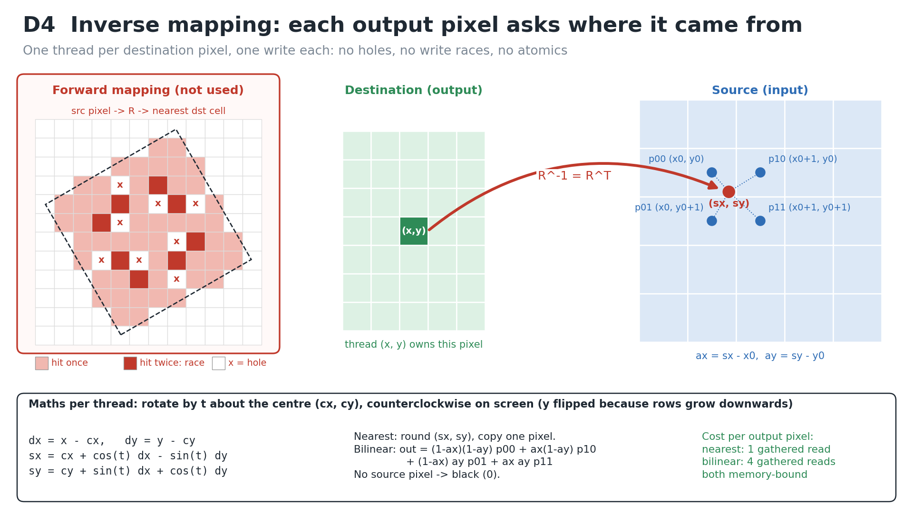
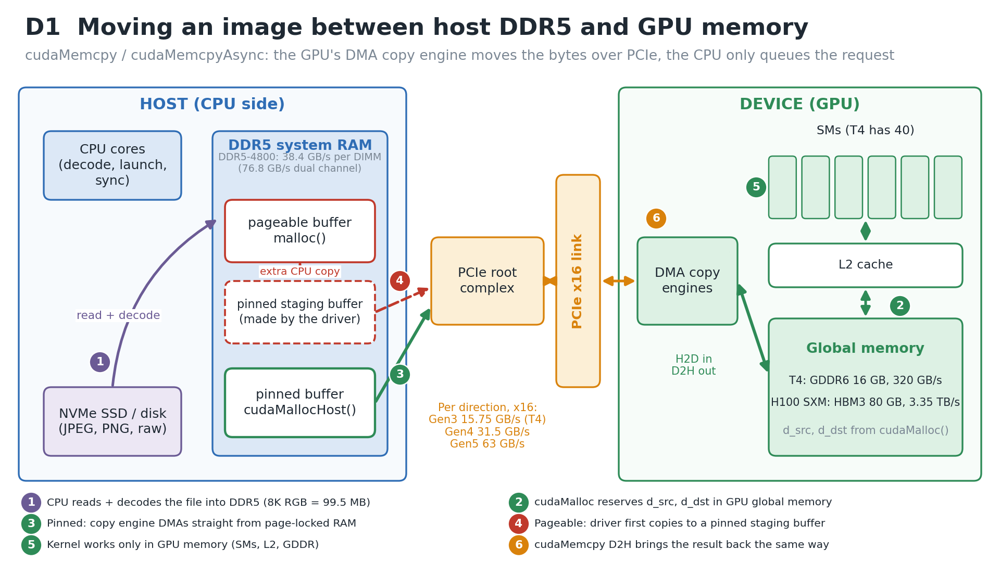
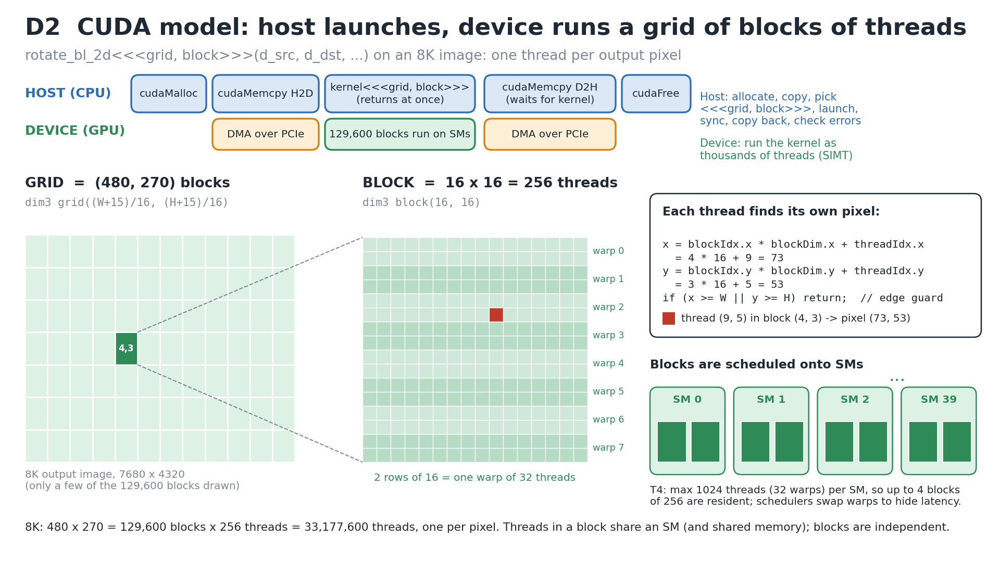
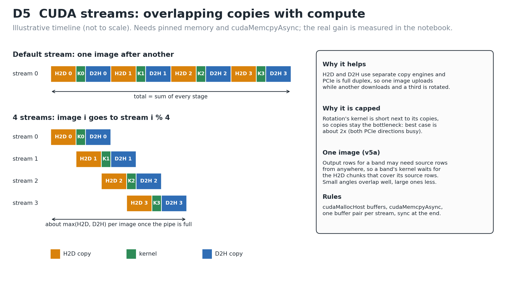
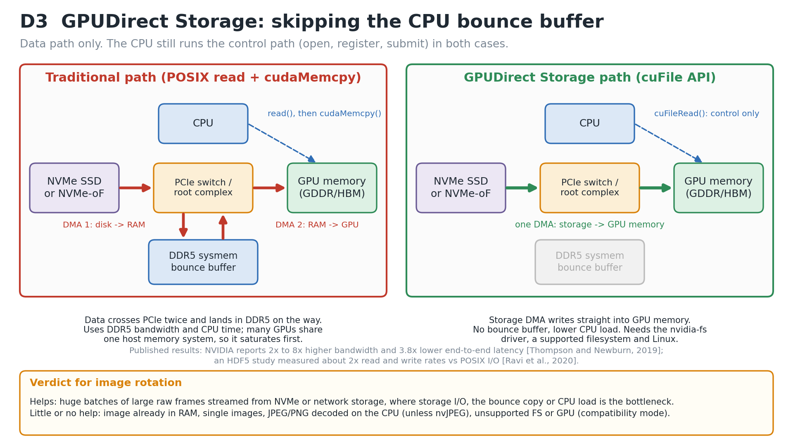

# FIT3143 Applied #2, Task 1: Image Rotation with GPU

**Team:** Erwyna Soo Wen Xin (36555789, esoo0013@student.monash.edu) and Taabish Farooq Bhat (35473932, ttaa0006@student.monash.edu)

**Artefacts:** `rotate_cuda.cu` (CUDA prototype, variants v0 to v6), `Applied2_Task1_Colab.ipynb` (build, run, sweeps, graphs), `rotate_cpu.c` (CPU check of the maths), `diagrams/` (D1 to D5), `code_snippets/`.

**The problem.** Rotate a W x H RGB image counterclockwise by θ about its centre with R = [[cos θ, -sin θ], [sin θ, cos θ]]. Each output pixel depends only on the input image, so the task is **data-parallel** with no dependencies between pixels. An 8K frame (7680 x 4320 x 3 bytes) is 99.5 MB and has 33.2 million independent work items.

**Design choice: inverse mapping (D4).** One thread owns one *destination* pixel and applies R^-1 = R^T to find its source point. Forward mapping (push each source pixel through R) leaves holes and lets two source pixels write the same output, which is a write race. Inverse mapping gives exactly one writer per output pixel, so we need no atomics and no synchronisation. Image rows grow downwards, so y is flipped before and after applying R^T. That keeps the turn counterclockwise on screen. Source points outside the image become black.

---

## 1a. Moving image data between host memory (DDR5) and GPU memory (GDDR)

1. **Load and decode (CPU).** The file is read from NVMe into host DDR5 and decoded (for example, JPEG to raw RGB).
2. **Allocate on the device.** `cudaMalloc` reserves `d_src` and `d_dst` in GPU global memory. That is GDDR5/GDDR6 on cards like the T4 (16 GB GDDR6, 320 GB/s [8]) or HBM on data-centre parts (H100 SXM: HBM3, 3.35 TB/s [10]). The host cannot dereference these pointers; they belong to a separate address space.
3. **Host to device (H2D) over PCIe.** `cudaMemcpy(d_src, h_src, n, cudaMemcpyHostToDevice)` hands the copy to the GPU's **DMA copy engine**. The engine reads host RAM through the PCIe root complex and writes GDDR. The CPU does not move the bytes itself.
4. **Pageable vs pinned host memory.** DMA needs physical pages that cannot be swapped out. A normal `malloc` buffer is *pageable*, so the driver first copies it into its own pinned staging buffer and then runs the DMA from there. That is an extra CPU copy and a second pass over DDR5 [4]. `cudaMallocHost` returns a `cudaError_t` and writes the address of a *page-locked* (pinned) buffer into its pointer argument. The engine can DMA straight from that buffer, and it is also required for copies to overlap with kernels [5]. The Best Practices Guide says pinned transfers "attain the highest bandwidth between the host and the device" [2]. Our v4 measures pageable against pinned (graph g3).
5. **Compute stays on the GPU.** The kernel reads `d_src` and writes `d_dst` in GDDR through the L2 cache. Nothing crosses PCIe while it runs.
6. **Device to host (D2H).** `cudaMemcpy(..., cudaMemcpyDeviceToHost)` copies the result back. It "returns only once the copy has completed" [3]. It is issued on the same stream as the kernel, so it also waits for the kernel to finish.

**Synchronisation semantics [3].** `cudaMemcpy` from pinned memory is synchronous with respect to the host. For pageable H2D, "a stream sync is performed before the copy is initiated". `cudaMemcpyAsync` only returns early, and only overlaps with other work, when the host buffer is pinned.

**Bandwidth ladder (why PCIe is the narrow pipe):**

| Link | Bandwidth | Note |
|---|---|---|
| DDR5-4800, one 64-bit DIMM / dual channel | 38.4 / 76.8 GB/s | 4800 MT/s x 8 B [7] |
| PCIe 3.0 x16 (Colab T4) | about 15.75 GB/s per direction | 8 GT/s per lane, 128b/130b [6]; about 12 GB/s achievable with pinned memory [2] |
| PCIe 4.0 / 5.0 x16 | about 31.5 / 63 GB/s per direction | 16 / 32 GT/s per lane [6]; "128 GB/s" figures are both directions added together [10] |
| T4 GDDR6 | 320 GB/s | 256-bit bus [8] |
| H100 SXM HBM3 | 3.35 TB/s | [10] |

At about 12 GB/s, one 8K frame takes roughly 8 ms each way. The kernel only has to stream 199 MB through a 320 GB/s memory system, which is under 1 ms. The copy, not the arithmetic, sets the end-to-end time.

**Other paths, briefly.** *Unified Memory* (`cudaMallocManaged`) migrates pages on demand, so the programming is simpler but it still moves the data over PCIe. *Zero-copy* mapped pinned memory lets kernels read host RAM directly over PCIe on every access, which is too slow for a gather-heavy kernel. *NVLink* replaces PCIe on some data-centre systems. *GPUDirect Storage* skips host RAM altogether (1c).

---

## 1b. The CUDA programming model, and the expected speed-up

**Host (CPU) responsibilities.** The host allocates host and device memory, copies inputs H2D, and chooses the execution configuration. It then launches the kernel, which is asynchronous: the call returns at once. After that it synchronises, copies the result D2H, checks every API call and launch (`CUDA_CHECK`, `cudaGetLastError`), and frees memory. The host is the controller in a master/worker model.

**Device (GPU) responsibilities.** The device runs the kernel as a very large number of lightweight threads in **SIMT** style (single instruction, multiple threads) [20]. The hardware groups them into **warps of 32** that issue together [1]. Warp schedulers switch between resident warps every cycle to **hide memory latency**.

**`<<<grid, block>>>` and the hierarchy.** `kernel<<<grid, block, shmem, stream>>>(args)`:

- **Thread:** one output pixel. It has private registers and its own `threadIdx`.
- **Block:** up to 1024 threads [1]. Ours is 16 x 16 = 256 threads, which is 8 warps. A block runs on a single **SM** and can share shared memory and `__syncthreads()`.
- **Grid:** every block of the launch. For 8K it is ceil(7680/16) x ceil(4320/16) = 480 x 270 = **129,600 blocks, 33,177,600 threads**. Blocks are independent, so they can be scheduled on any of the T4's 40 SMs in any order [8].
- **Index maths:** `x = blockIdx.x * blockDim.x + threadIdx.x` (same for y). A guard `if (x >= W || y >= H) return;` handles the grid rounded up past the image edge. Only warps on the image border diverge.

**Sample codes: one CUDA feature per variant, and how each changes speed-up** (full code in `rotate_cuda.cu`, slide versions in `code_snippets/`):

| Variant | Feature | Expected effect on speed-up (mechanism) |
|---|---|---|
| v0 | CPU serial loop, one core | Baseline T_serial. It is also the reference answer: every GPU output is compared byte by byte (built with `--fmad=false` so rounding matches). |
| v1 | 1D grid, 256-thread blocks | Large speed-up from data parallelism. Each thread pays for an integer `/` and `%` to turn its 1D id into (x, y). That is what makes v1 slower: 2.96 ms against 1.55 ms for v2. |
| v2 | 2D grid of 16 x 16 blocks | The 2D index comes straight from `blockIdx` and `threadIdx`, with no divide or modulo, and writes stay **coalesced** along rows. Block shape barely matters for nearest: 128 x 1 takes 1.44 ms and 16 x 16 takes 1.45 ms, so the gain over v1 is the index maths, not the cache. Shape does matter for bilinear, which reads 4 neighbours (16 x 8: 2.83 ms, 64 x 4: 4.00 ms). The block sweep (g4) varies the shape; **occupancy** is limited by registers, the 1024 threads/SM cap and the max blocks per SM. Tiny blocks (8 x 4) leave SMs under-filled. |
| v3 | Bilinear interpolation | 4 gathered reads and about 30 more flops per pixel. It is still **memory-bound**, so it costs much less than 4x on the GPU. The CPU pays for every operation serially, so the GPU speed-up for bilinear is usually *larger* than for nearest. |
| v4 | Pageable vs pinned host memory | Pageable adds the staging copy, so there is lower PCIe bandwidth and a lower end-to-end speed-up. The kernel is unchanged. |
| v5a | Streams, one image in 8 row chunks | A destination band can need source rows from anywhere, so each band's kernel waits (`cudaStreamWaitEvent`) only for the H2D chunks that cover its source rows. D2H of band i overlaps the kernel of band i+1. Overlap is better at small angles (5°) than large (30°). |
| v5b | Streams, batch of 8 images on 4 streams | H2D of one image, kernel of another and D2H of a third run together (separate copy engines, full-duplex PCIe). The per-image time approaches max(H2D, D2H) instead of the sum, which is at most about 2x for a copy-dominated job (D5). |
| v6 | Texture object, hardware bilinear | The texture unit does the 4-tap filter and border handling in hardware, through the texture cache. Its weights have only 8 fractional bits, so output differs by at most 1 intensity level (measured: 257,964 bytes, 0.26% of the output). That is a quality versus speed trade-off. |

**Expected speed-up on modern GPUs.** There are two numbers, and they should not be mixed up:

1. **Kernel-only speed-up.** Rotation does roughly 2 flops per byte (nearest) to 7 flops per byte (bilinear). That is far below the T4's balance point of 8.1 TFLOPS / 320 GB/s ≈ 25 flops/byte [9], [8]. So the kernel is **memory-bound** and the roofline caps it by bandwidth, not FLOPS [19]. Against a CPU that already saturates dual-channel DDR5 (76.8 GB/s), the ceiling is roughly the bandwidth ratio: about 4x for a T4 (320 GB/s) and about 44x for an H100 (3.35 TB/s). Against our *single-core* baseline the gap is far larger, because one core can neither saturate DRAM nor issue millions of independent gathers at once. The GPU has tens of thousands of threads in flight to hide latency.
2. **End-to-end speed-up** (H2D + kernel + D2H). By Amdahl's law [18], the copies are a part that more GPU cores cannot shrink. Even with an infinitely fast kernel, S_max = T_cpu / (T_H2D + T_D2H).

**Prediction for 8K, checked against the Colab run.** Our local check (`rotate_cpu.c`, `-O2`, one core of an Apple M3 Max) took **113 ms (nearest)** and **290 ms (bilinear)**. On a T4, copies take about 99.5 MB / 12 GB/s ≈ 8.3 ms each way, and the kernel is at least 199 MB / 320 GB/s ≈ 0.62 ms. That gives a kernel-only ceiling of about 180x but an end-to-end ceiling of only about 113 / 17.2 ≈ **6.6x**, with copies above 90% of GPU time. The Colab CPU is a slower core than the M3 Max (509 ms vs 113 ms for nearest), which is why the measured end-to-end speed-up is larger than this estimate. The measured values from the Colab run (graphs g1 to g6) are the ones on the slides:

| 8K, 30° | CPU (ms) | H2D (ms) | Kernel (ms) | D2H (ms) | Kernel SU | E2E SU |
|---|---|---|---|---|---|---|
| v2 nearest, pinned | 509.3 | 8.06 | 1.55 | 7.58 | 328x | 29.6x |
| v3 bilinear, pinned | 1302.8 | 8.06 | 2.69 | 7.59 | 484x | 71.0x |
| v4 nearest, pageable | 509.3 | 21.67 | 1.40 | 21.71 | 364x | 11.4x |

Measured on a Tesla T4 (Colab), one CPU core, mean of 10 runs after warm-up, 0 mismatched pixels for v1 to v4. Copies are 91% of the v2 time. The kernel reaches 128 GB/s, 40% of the 320 GB/s peak, so it is memory bound. Pinned memory is 2.7x faster than pageable for H2D. Streams give 1.81x on a batch of 8 images and 1.36x on one image. With a zero-time kernel, Amdahl caps the end-to-end speed-up at 509.3 / (8.06 + 7.58) = 32.6x, so 29.6x is 91% of the bound. Run to run, the v2 kernel varied from 1.45 to 2.11 ms (shared Colab GPU) while the copies stayed at 8.06 ms, so treat kernel-only speed-ups as roughly plus or minus 30%. v1 to v5 match the CPU byte for byte; v6 differs in 0.26% of bytes, by at most 1.

**What moves the speed-up up:** larger images (the fixed launch and transfer latency is amortised, so the scaled speed-up grows in the Gustafson sense), batching with streams, pinned memory, keeping images resident on the GPU across several operations, and faster links (PCIe 5.0, NVLink) or GPU-side decode and I/O (nvJPEG, GDS).

**State-of-the-art libraries.** NVIDIA NPP provides `nppiRotate_*` (angle, shift, interpolation mode) [22]. OpenCV's CUDA module provides `cv::cuda::rotate` and `cv::cuda::warpAffine` [24]. nvJPEG decodes JPEG on the GPU [23], so the CPU decode step leaves the pipeline.

**Vector (SIMD) vs GPU (SIMT) vs NPU.** CPU SIMD (AVX, NEON) applies one instruction to a short fixed-width vector. Rotation's scattered gathers fit it poorly. A GPU runs thousands of scalar threads in warps, with hardware gather, a texture unit and high-bandwidth memory. That suits pixel-parallel warps like this one. An NPU (for example, the TPU's systolic matrix unit [21]) is built for dense low-precision matrix multiply. A rotation is a gather, not a matmul, so it maps poorly unless it is expressed as a grid-sample layer inside a neural network.

---

## 1c. GPUDirect Storage (GDS) and image rotation

**What it is.** GDS is part of NVIDIA's Magnum IO GPUDirect family. It opens a **direct DMA path between storage and GPU memory**: local NVMe, NVMe-oF, or distributed file systems such as Lustre and VAST NFS [11]. Normally a read goes storage → CPU **bounce buffer** in system memory → `cudaMemcpy` over PCIe → GPU. With GDS, the storage device's DMA engine writes straight into GPU memory [11], [12]. The CPU keeps only the control path.

**How it is used.** The cuFile API [13]: `cuFileDriverOpen`, `cuFileHandleRegister` on a file opened with `O_DIRECT`, optionally `cuFileBufRegister` on the device buffer, then `cuFileRead(fh, d_src, bytes, file_off, buf_off)` fills `d_src` directly. `cuFileWrite` does the reverse for the rotated output. The kernel launch is unchanged.

**Requirements and fallback.** GDS needs the `nvidia-fs` kernel driver and runs on Linux x86-64 only. It needs a supported file system (for example, ext4/XFS on NVMe, Lustre, GPFS, WekaFS, BeeGFS, NFS). Tmpfs, OverlayFS, ZFS and Btrfs run only in compatibility mode. Data Center and Quadro cards with compute capability above 6 are supported; other cards run only in compatibility mode [14]. In compatibility mode, cuFile "stages through CPU system memory", so it becomes the traditional path again [11].

**Evidence.**

- NVIDIA reports "2x-8x higher bandwidth", "3.8x lower end-to-end latency", and CPU utilisation "near zero during large transfers" on a DGX-2 [15].
- An independent HDF5 study measured about 2x read and write rates against POSIX I/O on local storage [16].
- The overview guide notes the latency gain is most visible for small transfers, and that removing the bounce buffer reduces load on the CPU [11].
- Research is moving further, towards GPU-initiated storage access (BaM) [17].

**Verdict: beneficial for the company's bulk pipeline, not for a single photo.**

- **Where it helps.** The team lead wants to rotate lots of high-resolution images every day. On the T4 the kernel took only 1.55 of 17.19 ms (9%) of the per-image GPU time, so an end-to-end pipeline is **I/O-bound** (Amdahl again). If frames are stored raw (or decoded on the GPU with nvJPEG) and streamed from NVMe or network storage, GDS attacks exactly that bottleneck. It removes the second trip through DDR5, removes the bounce copy, and frees CPU cores that would otherwise sit in `read()` and `memcpy`. That matters most when several GPUs share one host memory system [15]. It combines well with streams (v5b) and `cuFileWrite` for the output.
- **Where it does not help.**
  - The image is *already* in host RAM, which is our benchmark's case. GDS only changes the storage → GPU leg.
  - A single image or small files, where setup and registration dominate.
  - JPEG/PNG decoded on the CPU. The CPU is back in the data path, so the bounce buffer returns in another form.
  - The bottleneck is the PCIe link itself. GDS saves a hop through host memory, but the data still crosses PCIe once.
  - Unsupported file systems, OS or GPU, which silently fall back to compatibility mode.
  - On a shared Colab VM we cannot assume `nvidia-fs` or a supported file system, so we did not run GDS there. Our code sample covers the host path only.

---

## Limitations and future work

- **Canvas and format.** The output keeps the input size, so rotated corners are cropped (no "expand to fit" option). Only 8-bit RGB and binary PPM are supported; there is no JPEG decode.
- **Baseline fairness.** The CPU baseline is single-threaded. An OpenMP or SIMD CPU version would give a fairer "best CPU" comparison.
- **Timing noise.** Colab is a shared VM. We report the mean of 10 runs after a warm-up; adding standard deviation would show the spread.
- **v5a overlap depends on θ.** Large angles need most of the source before any band can start. Streams across images (v5b) is the better design for throughput.
- **v6 texture precision.** The 8-bit filter weights mean v6 is close to, but not bit-identical with, the CPU bilinear result.
- **Future work.**
  - Compare against NPP `nppiRotate` and OpenCV CUDA.
  - Add an nvJPEG + GDS + streams pipeline on a GDS-capable server.
  - Try shared-memory staging of each block's source patch.
  - Measure on a PCIe 4.0/5.0 GPU to see how the end-to-end ceiling moves.

---

## References

[1] NVIDIA, "CUDA Programming Guide," v13.4, 2026. [Online]. Available: https://docs.nvidia.com/cuda/cuda-programming-guide/

[2] NVIDIA, "CUDA C++ Best Practices Guide," v13.4, 2026. [Online]. Available: https://docs.nvidia.com/cuda/cuda-c-best-practices-guide/

[3] NVIDIA, "CUDA Runtime API: API synchronization behavior." [Online]. Available: https://docs.nvidia.com/cuda/cuda-runtime-api/api-sync-behavior.html

[4] M. Harris, "How to Optimize Data Transfers in CUDA C/C++," NVIDIA Technical Blog, Dec. 4, 2012. [Online]. Available: https://developer.nvidia.com/blog/how-optimize-data-transfers-cuda-cc/

[5] M. Harris, "How to Overlap Data Transfers in CUDA C/C++," NVIDIA Technical Blog, Dec. 13, 2012. [Online]. Available: https://developer.nvidia.com/blog/how-overlap-data-transfers-cuda-cc/

[6] PCI-SIG, "PCI Express Base Specification, Revision 5.0," 2019. [Online]. Available: https://pcisig.com/specifications

[7] JEDEC Solid State Technology Association, "DDR5 SDRAM," JESD79-5, Jul. 2020. [Online]. Available: https://www.jedec.org/standards-documents/docs/jesd79-5d

[8] NVIDIA, "NVIDIA Turing GPU Architecture," whitepaper, 2018. [Online]. Available: https://images.nvidia.com/aem-dam/en-zz/Solutions/design-visualization/technologies/turing-architecture/NVIDIA-Turing-Architecture-Whitepaper.pdf

[9] NVIDIA, "NVIDIA T4 Tensor Core GPU." [Online]. Available: https://www.nvidia.com/en-us/data-center/tesla-t4/

[10] NVIDIA, "NVIDIA H100 Tensor Core GPU." [Online]. Available: https://www.nvidia.com/en-us/data-center/h100/

[11] NVIDIA, "NVIDIA GPUDirect Storage Overview Guide." [Online]. Available: https://docs.nvidia.com/gpudirect-storage/overview-guide/index.html

[12] NVIDIA, "NVIDIA GPUDirect Storage Design Guide." [Online]. Available: https://docs.nvidia.com/gpudirect-storage/design-guide/index.html

[13] NVIDIA, "cuFile API Reference Guide." [Online]. Available: https://docs.nvidia.com/gpudirect-storage/api-reference-guide/index.html

[14] NVIDIA, "NVIDIA GPUDirect Storage Release Notes." [Online]. Available: https://docs.nvidia.com/gpudirect-storage/release-notes/index.html

[15] A. Thompson and C. J. Newburn, "GPUDirect Storage: A Direct Path Between Storage and GPU Memory," NVIDIA Technical Blog, Aug. 6, 2019. [Online]. Available: https://developer.nvidia.com/blog/gpudirect-storage/

[16] J. Ravi, S. Byna, and Q. Koziol, "GPU Direct I/O with HDF5," in Proc. IEEE/ACM 5th Int. Parallel Data Systems Workshop (PDSW), 2020, pp. 28-33, doi: 10.1109/PDSW51947.2020.00010.

[17] Z. Qureshi et al., "GPU-initiated on-demand high-throughput storage access in the BaM system architecture," in Proc. 28th ACM Int. Conf. Architectural Support for Programming Languages and Operating Systems (ASPLOS), vol. 2, 2023, pp. 325-339, doi: 10.1145/3575693.3575748.

[18] G. M. Amdahl, "Validity of the single processor approach to achieving large scale computing capabilities," in Proc. AFIPS Spring Joint Computer Conf., 1967, pp. 483-485, doi: 10.1145/1465482.1465560.

[19] S. Williams, A. Waterman, and D. Patterson, "Roofline: An insightful visual performance model for multicore architectures," Commun. ACM, vol. 52, no. 4, pp. 65-76, 2009, doi: 10.1145/1498765.1498785.

[20] E. Lindholm, J. Nickolls, S. Oberman, and J. Montrym, "NVIDIA Tesla: A unified graphics and computing architecture," IEEE Micro, vol. 28, no. 2, pp. 39-55, 2008, doi: 10.1109/MM.2008.31.

[21] N. P. Jouppi et al., "In-datacenter performance analysis of a tensor processing unit," in Proc. 44th Annu. Int. Symp. Computer Architecture (ISCA), 2017, pp. 1-12, doi: 10.1145/3079856.3080246.

[22] NVIDIA, "NPP: Image Geometry Transforms Functions." [Online]. Available: https://docs.nvidia.com/cuda/npp/image_geometry_transforms.html

[23] NVIDIA, "nvJPEG Documentation." [Online]. Available: https://docs.nvidia.com/cuda/nvjpeg/index.html

[24] OpenCV, "Image Warping (cudawarping module)," OpenCV 4.x documentation. [Online]. Available: https://docs.opencv.org/4.x/db/d29/group__cudawarping.html

---

## Generative AI declaration

We used Claude (Anthropic), Gemini (Google) and ChatGPT (OpenAI) while preparing this work, as the spec allows. FIT3143_A2_AI_Declaration.pdf lists every tool, what it was used for and the full prompt records. We ran, checked and edited all outputs ourselves, and every measured number comes from our own Colab T4 run.
