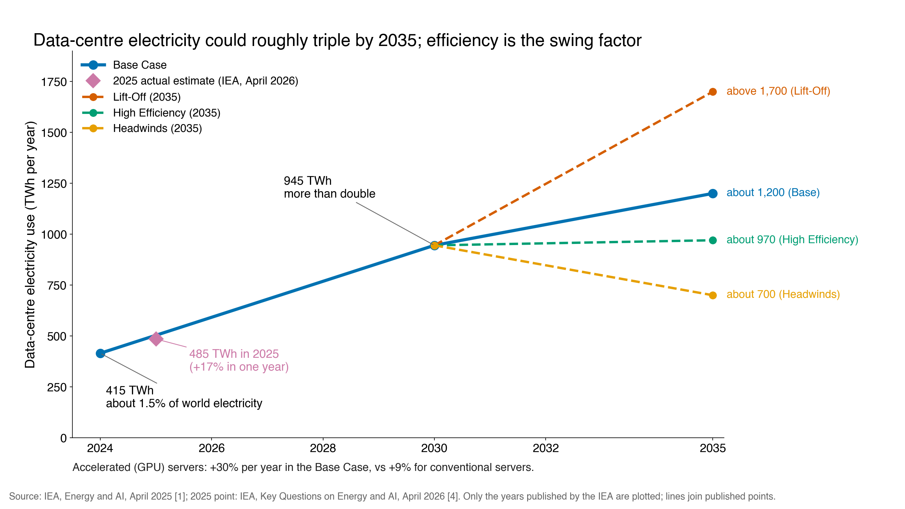
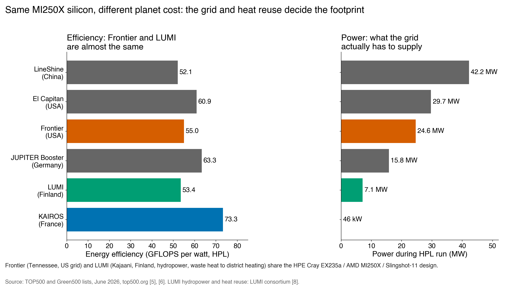
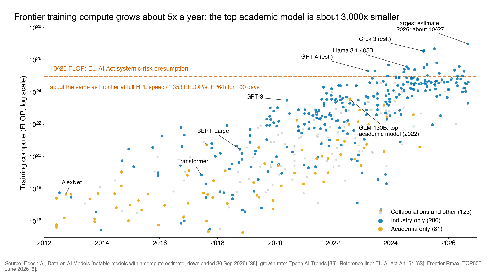
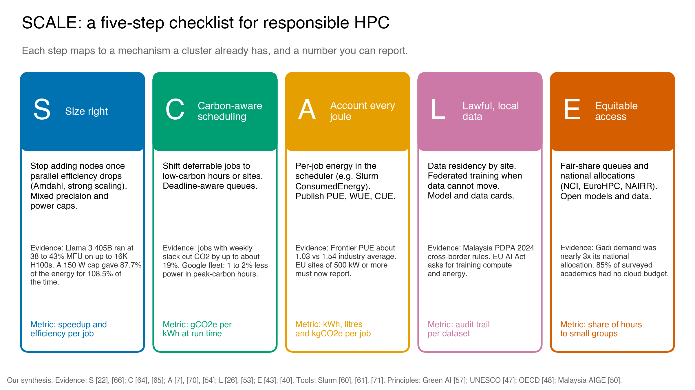

# Task 2: Ethical Implications of Scaling HPC for AI

**FIT3143 Parallel Computing, Applied #2** | Monash University Malaysia | 30 September 2026 
Erwyna Soo Wen Xin (36555789, esoo0013@student.monash.edu) and Taabish Farooq Bhat (35473932, ttaa0006@student.monash.edu) 
**Task 2 author:** Erwyna Soo Wen Xin

## Summary

Modern AI is a parallel computing workload: dense matrix operations spread across tens of thousands of GPUs joined by a high-speed interconnect. Scaling that workload creates four ethical problems, and each one has a parallel computing cause and a parallel computing fix.

| Topic | Core problem | Parallel computing cause | Headline number |
|---|---|---|---|
| (a) Energy and environment | Data-centre electricity could roughly triple by 2035 | Accelerated servers, low utilisation, grid carbon | 415 TWh (2024) to about 1,200 TWh (2035 Base) [1] |
| (b) Governance, security, fairness | Data and chips cross borders; low-resource languages are underserved | Data-parallel training, gradient exchange, tokenisation | Malay is 0.086% of Common Crawl [2] |
| (c) Access | Frontier AI needs a cluster only industry can buy | Strong scaling needs many GPUs | Over 90% of notable 2025 models from industry [3] |
| (d) Frameworks | Principles exist but lack metrics | Scheduler, accounting and placement are the levers | Our SCALE checklist (Chart C4) |

Method: every figure below was checked against its primary source on 30 September 2026. Where a claim from the unit's supplementary lecture did not survive checking, we say so (see the aviation comparison in (a) and the GPUs-per-gigawatt estimate).

## (a) Environmental and energy impact

**Finding A1. Demand is rising fast, and GPU servers drive it.** Data centres used about 415 TWh in 2024, around 1.5% of world electricity, and the IEA Base Case more than doubles this to about 945 TWh by 2030 [1]. The 2026 update already estimates 485 TWh for 2025, a 17% jump in one year [4]. *Why:* the growth is driven by accelerated servers. GPU server electricity grows about 30% a year in the Base Case against 9% for conventional servers [1]. *So what:* by 2035 the cases range from about 700 TWh (Headwinds) to above 1,700 TWh (Lift-Off), with High Efficiency at about 970 TWh (Chart C2). The spread between cases is bigger than today's total, so the choices cluster designers and users make now change the global total.

**Finding A2. The footprint of a FLOP depends on the grid more than the chip.** Frontier (USA) and LUMI (Finland) are almost the same machine: both are HPE Cray EX235a nodes with AMD MI250X GPUs on a Slingshot-11 interconnect. On the June 2026 lists Frontier is ranked 3rd (1.353 EFLOP/s at 24.6 MW) and LUMI 11th (379.7 PFLOP/s at 7.1 MW) [5], and on the Green500 they reach 54.98 and 53.43 GFLOPS/W respectively (Chart C1) [6]. Frontier also runs at a PUE of about 1.03 at peak with warm-water cooling [7]. So both are efficient in the narrow sense. The difference is outside the rack. LUMI runs on 100% hydropower and its waste heat covers up to 20% of Kajaani's district heating, with a potential saving of 12,400 t CO2 a year [8]. *So what:* GFLOPS/W and PUE describe how well a site turns electricity into computation. They say nothing about carbon intensity (gCO2e/kWh) or heat reuse. A responsible site must report both. *Alternative that loses:* ranking sites only by Green500 score would put Frontier ahead of LUMI, which hides the real carbon gap.

**Finding A3. Single training runs are measurable, and early estimates were often wrong.** Strubell et al. estimated 626,155 lb CO2e for a Transformer with neural architecture search [9]. Patterson et al. later showed the real search, run on TPUs in a cleaner data centre, emitted about 3.2 t, 88 times less [10]. They put GPT-3 training at 1,287 MWh and 552 t CO2e [10]. BLOOM (176B parameters) used 433 MWh on France's Jean Zay cluster at 57 gCO2e/kWh, giving 24.7 t (dynamic power only) or 50.5 t including idle power and hardware manufacture [11]. *Why the gap:* energy per run is similar in order of magnitude, but grid intensity differs by about 7.5 times (429 vs 57 g/kWh) [11]. Idle power alone was 29% of BLOOM's footprint [11], which is a utilisation problem, not a model problem. Patterson et al. later showed that choosing the model, machine, data centre and location well cut Google's training CO2e by 650 times over four years [12].

**Finding A4. Inference and water are the hidden costs.** Per 1,000 inferences, text classification uses about 0.002 kWh while image generation uses about 2.9 kWh [13]. Once a model is deployed at scale, inference can dominate lifetime energy. Water is the second hidden input: training GPT-3 in US data centres could directly evaporate about 700,000 litres of freshwater (5.4 million litres including water used to generate the electricity), and global AI could withdraw 4.2 to 6.6 billion m3 of water in 2027 [14].

**Compare and contrast: the aviation claim.** The supplementary lecture quotes a chart saying AI data centres emit more CO2 than aviation. We checked the source. The chart is built on an Accenture *projection for 2030*: AI could reach 3.4% of global CO2 emissions [73]. Accenture never mentions aviation; the comparison with aviation's roughly 2.5% today was added by media coverage [15]. The IEA's current estimate is about 180 Mt CO2 for *all* data centres in 2024, around 0.5% of combustion emissions, rising to 300 Mt (Base) or 500 Mt (Lift-Off) by 2035 [16], [1]. So the accurate claim is: "data centres are one of the few sectors, with road transport and aviation, whose emissions are still rising" [16], not "they already exceed aviation". *Limitation:* both numbers are modelled estimates. Operators rarely publish per-site energy, which is exactly the gap Finding D2 addresses.

**Local lens: Malaysia.** Johor went from about 10 MW of data-centre capacity in early 2021 to about 1.3 GW by November 2024 [17]. The energy transition ministry told Parliament in July 2026 that data centres could use up to 31% of Peninsular electricity by 2035 (73,274 GWh), up from about 7% now [18]. By June 2026, 42 connected projects held 5.65 GW of contracted maximum demand but drew only 1.26 GW of actual load [19]. Johor stopped approving new Tier 1 and Tier 2 (high water use) data centres in November 2025 [20]. *So what:* unlike Kajaani, Johor has no cold climate for free cooling and no heating demand to absorb waste heat, and 79% of Malaysia's electricity still came from fossil fuels in 2025 [21]. The Frontier vs LUMI lesson therefore applies directly: the same GPUs in Johor carry a larger carbon and water cost per FLOP than in the Nordics.

**Link to parallel computing.** Energy = power x time. Power scales with the number of GPUs switched on; time scales with how well the job is parallelised. A job that scales poorly still keeps every GPU powered while it waits on communication (all-reduce over the interconnect) or the serial fraction. Meta's Llama 3 405B run on up to 16K H100 GPUs reached a Model FLOPs Utilisation of only 38 to 43%, and had 466 job interruptions in 54 days [22]. So more than half of the peak GPU throughput, and much of the energy behind it, did no useful model work. Industry now sizes these clusters in gigawatts, not FLOPs. An H100 is rated up to 700 W [23], and with host CPUs, NICs and power supplies each GPU draws about 1.3 kW; a 100,000 GPU cluster needs over 150 MW [24]. So 1 GW feeds roughly 650,000 H100-class GPUs, not a few thousand. At that scale the interconnect and failure rate, not the chip, set the limit.

**Our recommendation (a).** Report energy, carbon intensity and water per job and per site, not just GFLOPS/W. For Malaysian sites, make heat reuse or recycled water a condition of approval, following Johor's Tier 3/4 direction.

## (b) Data governance, security and fairness

**Finding B1. Compute location decides whose law governs the data.** About 75% of the world's AI supercomputer performance sits in the United States and about 15% in China [25]. The US alone hosts 5,427 data centres, more than ten times any other country [3]. *Why it matters:* when a Malaysian user's data trains a model on a foreign cluster, the data falls under that country's jurisdiction. Malaysia's PDPA was amended in 2024 to add mandatory breach notification, data protection officers and new cross-border transfer guidelines (April 2025) [26]. *Parallel computing link:* in data-parallel training each node holds a shard of the data and exchanges gradients through all-reduce. If nodes sit in different jurisdictions, data-derived information crosses borders every iteration, and gradients can leak training samples [27]. Federated learning keeps raw data on site and only moves model updates [28]. *Trade-off:* it costs many more communication rounds and slower convergence than a single-site cluster. *So what:* data residency becomes a job placement constraint for the scheduler, not just a legal note.

**Finding B2. Chips are now treated as security assets, and Malaysia sits in the middle.** US export controls since October 2022 restrict advanced AI chips by performance thresholds [29]. The January 2025 AI Diffusion rule, which would have capped chip imports for most countries outside a group of close US partners, was rescinded in May 2025 and replaced with narrower guidance on diversion [30]. Two months later Malaysia required a Strategic Trade Permit for every export, transshipment or transit of US-origin high-performance AI chips [31]. *Why:* compute is the one AI input that is physical, countable and traceable. *So what:* a Malaysian data centre must now prove where its GPUs go and who runs jobs on them. That is an accounting problem that cluster job logs can solve (see SCALE, step A). *Limitation:* export rules change often; the January 2026 US policy on H200-class sales to China shows how fast [32].

**Finding B3. The training data is not fair to Malay speakers, and fixing it costs compute.** In Common Crawl's September 2026 snapshot, English is 41.86% of pages and Malay is 0.086% [2]. Ahuja et al. found a significant gap between LLM performance in English and other languages, largest for low-resource languages with non-Latin scripts; GPT-4 narrows it but does not close it [33]. They also found tokenizer fertility of about 10 tokens per word for Tamil, so a Tamil prompt needs far more tokens, and so more inference FLOPs and cost, than the same prompt in English [33]. Regional responses include AI Singapore's SEA-LION, covering 11 Southeast Asian languages including Malay [34], and Malaysia's ILMU, launched in August 2025 [35]. *Parallel computing link:* the two classic fairness criteria from the lecture, demographic parity and equal opportunity [36], can be met in three places. Pre-processing (rebalancing or upsampling Malay text) adds training tokens, so more GPU hours. In-processing changes the loss and needs a full retrain. Post-processing adjusts decision thresholds after training [36] and needs no extra training FLOPs. *So what:* fairness has a compute budget. Labs that cannot afford a retrain can still apply post-processing, but a national model like ILMU exists because post-processing cannot add knowledge the data never had.

**Our recommendation (b).** Treat data residency as a scheduler placement rule. Publish a model card listing training data languages and where the training cluster was located.

## (c) Socio-economic and accessibility challenges

**Finding C1. The compute gap between industry and academia is now about three orders of magnitude.** Nearly 90% of notable AI models in 2024 came from industry, up from 60% in 2023 [37], and over 90% in 2025 [3]. In Epoch AI's database the largest academic-only model is GLM-130B (Tsinghua, 2022) at about 3.5 x 10^23 FLOP, while the largest 2026 estimate is about 10^27 FLOP [38], roughly 3,000 times more (Chart C3). Frontier training compute grows about 5 times a year and training cost about 3.5 times a year [39]. *Why:* the entry ticket is now a cluster. xAI's Colossus had 200,000 AI chips, cost about US$7 billion and needed 300 MW [25].

**Finding C2. Academics work with 1 to 8 GPUs.** In a 2024 survey of 50 researchers across 35 institutions, 85% had zero budget for cloud compute and typical access was 1 to 8 GPUs [40]. The same study replicated Pythia-1B, first trained on 64 GPUs in 3 days, on 4 GPUs in 18 days [40]. *Parallel computing link:* this is strong scaling run backwards. With fewer processors the work is the same, so wall time grows; it is feasible for small models but not for frontier ones. Besiroglu et al. find academic-only teams are now under-represented in compute-heavy topics such as foundation models [41]. *So what:* if only companies can train frontier models, only companies can audit them. Independent scrutiny is itself a fairness issue.

**Finding C3. Shared national infrastructure helps, but is small and oversubscribed.** Compare three public models:

| Programme | Scale | Signal of demand |
|---|---|---|
| NCI Gadi (Australia, NCRIS funded) | 776 GPUs, over 10 PF peak [42] | Requests of 2.2 billion hours, nearly 3x the annual national allocation [43] |
| EuroHPC (EU) | 19 AI Factories, over EUR 2.6 billion committed [44] | Gigafactory call open to November 2026 [45] |
| NAIRR pilot (US, since January 2024) | 13 agencies, 28 partners [46] | Over 600 projects and 6,000 students supported [46] |

*Compare and contrast:* Gadi's 776 GPUs are about 1/250 of Colossus's 200,000 chips, so public systems cannot match industry on scale. Their value is *allocation*: merit-based, fair-share queues open to any researcher. *So what:* for Malaysia, where private capacity is booming in Johor, a national allocation scheme would turn private capacity into public access. *Alternative that loses:* cloud credits alone expire and give no guaranteed queue priority; a fair-share allocation does.

**Our recommendation (c).** Make a share of approved data-centre capacity available to Malaysian universities through a national fair-share allocation, modelled on NCI's merit scheme.

## (d) Frameworks and principles for responsible HPC

**Finding D1. The ethics frameworks agree on values but say little about compute.** UNESCO's Recommendation (193 member states, November 2021) lists "environment and ecosystems flourishing" as a core value and has an Environment and Ecosystems policy area [47]. The OECD AI Principles (2019, updated 2024) open with "inclusive growth, sustainable development and well-being" [48]. Australia's first principle is "human, societal and environmental wellbeing" [49]. Malaysia's AIGE guidelines (MOSTI, September 2024) set seven principles: fairness; reliability, safety and control; privacy and security; inclusiveness; transparency; accountability; and pursuit of human benefit and happiness [50]. *Compare:* AIGE mentions environmental impact in its text but has no stand-alone environmental principle, and all four are voluntary. None of them names a metric a cluster operator could report. Practitioner guidance is more concrete. TierPoint lists seven elements of sustainable HPC, from environmental monitoring and heat reuse to workload optimisation and recycling [51], and SC25, the main HPC conference, featured Sandia's Elaine Raybourn on shaping the ethical future of HPC and AI [52]. *So what:* principles set direction, but they need an engineering layer underneath.

**Finding D2. Regulation is starting to require numbers.** The EU AI Act presumes a general-purpose model has systemic risk once training compute exceeds 10^25 FLOP [53], and its documentation duties include the computational resources and known or estimated energy use of training [53]. Separately, the EU Energy Efficiency Directive makes data centres of 500 kW or more report energy performance, including PUE, water use, renewable share and waste-heat reuse, to a European database [54], [55]. *Compare:* the AI Act regulates a *model* by its FLOP count; the Directive regulates a *site* by its kW. Together they cover both ends of the parallel stack. Malaysia has neither yet. Its National AI Action Plan 2026 to 2030 was released in July 2026, and an AI Governance Bill is still in public consultation [56]. *Limitation:* a FLOP threshold is a proxy. Efficiency gains mean a capable model can be trained under 10^25 FLOP.

**Finding D3. Green AI turns efficiency into a research metric.** Schwartz et al. argued that efficiency should be an evaluation criterion alongside accuracy, and that papers should report the floating point operations (FPO) needed for a result [57]. Varoquaux, Luccioni and Whittaker (FAccT 2025) go further: compute demand grows faster than model performance, and the bigger-is-better paradigm concentrates power; they ask every study to report compute cost, energy and memory for training and inference [58]. *Why it works:* once people have to report a number, they try to lower it. The Software Carbon Intensity specification, now ISO/IEC 21031:2024, gives a formula for this: SCI = ((E x I) + M) per R, that is, energy times grid intensity plus embodied carbon, per functional unit [59].

**Finding D4. The scheduler is where we can actually enforce this.** Three tools already exist in production HPC.
1. *Energy accounting.* Slurm's AcctGatherEnergyType plugins (RAPL, IPMI, GPU) record joules per job, and `sacct` reports them as ConsumedEnergy [60], [61]. NVIDIA DCGM gives per-job GPU energy through prologue and epilogue scripts [62]. *Limitation:* Slurm warns the figure is only exact for exclusive node allocations [61]. This matters because fewer than 30% of surveyed HPC users know their own energy use; Kamatar et al. propose charging allocations in energy or carbon instead of core-hours [63].
2. *Carbon-aware scheduling.* Google's carbon-intelligent system shifts flexible work using day-ahead carbon forecasts and "virtual capacity curves"; its fleet trial cut power by 1 to 2% in the highest-carbon hours [64]. Wiesner et al. showed that ML jobs which can wait until later in the week can cut emissions by up to about 19% when jobs can be paused and resumed [65]. *Why:* grid carbon intensity varies by hour and day, and many batch jobs have slack in their deadline.
3. *Power capping and idle power-down.* Capping GPUs from 250 W to 150 W for BERT training used 87.7% of the energy for 108.5% of the time [66]. Slurm's power-saving mode suspends idle nodes after SuspendTime [67]. *Alternative that loses:* buying offsets does not reduce grid load at peak hours, and the scheduler options above cost almost nothing.

**Local lens: shared infrastructure as an equity policy.** See (c): NCI Gadi, EuroHPC and the US NAIRR pilot show that public, fair-share access is a framework in its own right, not just a funding line.

### Our proposed framework: SCALE

We combine the evidence above into a five-step checklist (Chart C4). Each step maps to a mechanism a cluster already has and a number it can report.

| Step | What to do | Parallel computing mechanism | Evidence | Report |
|---|---|---|---|---|
| **S**ize right | Stop adding GPUs when parallel efficiency drops. Use mixed precision and power caps. | Amdahl's law, strong scaling, MFU | Amdahl's serial fraction caps speedup [68]; Llama 3 MFU 38 to 43% [22]; FP16 halves memory [69]; power cap saves about 12% energy [66] | Speedup and efficiency per job |
| **C**arbon-aware scheduling | Hold deferrable jobs for low-carbon hours or sites. | Deadline-aware batch queues | Up to about 19% less CO2 [65]; 1 to 2% fleet peak cut [64] | gCO2e/kWh at run time |
| **A**ccount every joule | Turn on per-job energy accounting. Publish PUE, WUE and CUE. | Slurm ConsumedEnergy, DCGM | Frontier PUE 1.03 vs 1.54 average [7], [70]; EU EED reporting [54] | kWh, litres, kgCO2e per job |
| **L**awful, local data | Keep data in its jurisdiction; move the model, not the data. | Federated or site-local training | PDPA 2024 [26]; gradient leakage [27]; FedAvg [28] | Audit trail per dataset |
| **E**quitable access | Reserve fair-share capacity for small and public users. | Slurm Fair Tree fair-share [71], national allocations | Gadi oversubscribed about 3x [43]; NAIRR [46] | Share of GPU hours to small groups |

*Why a checklist and not another set of principles:* D1 shows the principles already exist. What is missing is a link from a principle to a scheduler setting. SCALE gives that link. *Alternatives that lose:* a pure carbon tax on compute would hit universities hardest (see c); a pure FLOP cap would freeze science along with frontier AI.

## Limitations and future work

1. **Most AI energy numbers are estimates.** Few operators publish per-job or per-model energy. GPT-4 and several 2025 and 2026 models appear in Epoch AI's data only as "likely" or "speculative" estimates [38]. We plotted them but labelled them as estimates.
2. **HPL is not an AI workload.** Green500 GFLOPS/W is measured with FP64 LINPACK. AI training runs in BF16 or FP8 at a much higher throughput per watt, so our Frontier comparison in Chart C3 is an order-of-magnitude guide, not an exact equivalence.
3. **Carbon-aware scheduling has limits.** Its gains depend on how much the local grid varies and on job deadline slack. The Google fleet result was 1 to 2% at peak hours [64], much lower than single-region studies. Power capping also has a rebound risk: users may submit more jobs to make up for the slowdown [72].
4. **Malaysian data is thin.** Malaysia has no public equivalent of the EU data-centre energy database, so our Johor figures rely on parliamentary answers, analyst reports and news. That gap is itself one of our recommendations.
5. **Future work.** (i) Measure it ourselves: enable Slurm energy accounting on a small cluster and compare the energy of a strong-scaling sweep (1 to 16 GPUs) for our Task 1 CUDA kernel. (ii) Test a simple carbon-aware delay policy using hourly grid-intensity data for Peninsular Malaysia. (iii) Track the EU data-centre rating scheme proposed in September 2026 [54] and Malaysia's planned AI Governance Bill.

## References

IEEE style. All online sources accessed 30 September 2026.

[1] International Energy Agency, "Energy and AI," IEA, Paris, France, Apr. 2025. [Online]. Available: https://www.iea.org/reports/energy-and-ai. Accessed: Sep. 30, 2026.

[2] Common Crawl, "Statistics of Common Crawl monthly archives: Distribution of languages (CC-MAIN-2026-39)," commoncrawl.github.io, 2026. [Online]. Available: https://commoncrawl.github.io/cc-crawl-statistics/plots/languages. Accessed: Sep. 30, 2026.

[3] Stanford Institute for Human-Centered AI, "The AI Index 2026 annual report," Stanford, CA, USA, Apr. 2026. [Online]. Available: https://hai.stanford.edu/ai-index/2026-ai-index-report. Accessed: Sep. 30, 2026.

[4] International Energy Agency, "Key questions on energy and AI," IEA, Paris, France, Apr. 2026. [Online]. Available: https://www.iea.org/reports/key-questions-on-energy-and-ai/executive-summary. Accessed: Sep. 30, 2026.

[5] TOP500, "TOP500 list, June 2026," top500.org, Jun. 2026. [Online]. Available: https://www.top500.org/lists/top500/list/2026/06/. Accessed: Sep. 30, 2026.

[6] TOP500, "Green500 list, June 2026," top500.org, Jun. 2026. [Online]. Available: https://www.top500.org/lists/green500/list/2026/06/. Accessed: Sep. 30, 2026.

[7] Oak Ridge National Laboratory, "Computer engineers at ORNL pioneer approaches to energy efficient supercomputing," ornl.gov, Sep. 10, 2024. [Online]. Available: https://www.ornl.gov/news/computer-engineers-ornl-pioneer-approaches-energy-efficient-supercomputing. Accessed: Sep. 30, 2026.

[8] LUMI consortium, "LUMI data center receives the Green Data Centre of the Year award," lumi-supercomputer.eu, Mar. 9, 2023. [Online]. Available: https://lumi-supercomputer.eu/lumi-data-center-receives-the-green-data-centre-of-the-year-award/. Accessed: Sep. 30, 2026.

[9] E. Strubell, A. Ganesh, and A. McCallum, "Energy and policy considerations for deep learning in NLP," in Proc. 57th Annu. Meeting Assoc. Comput. Linguistics (ACL), Florence, Italy, 2019, pp. 3645-3650, doi: 10.18653/v1/P19-1355.

[10] D. Patterson et al., "Carbon emissions and large neural network training," arXiv:2104.10350, Apr. 2021. [Online]. Available: https://arxiv.org/abs/2104.10350. Accessed: Sep. 30, 2026.

[11] A. S. Luccioni, S. Viguier, and A.-L. Ligozat, "Estimating the carbon footprint of BLOOM, a 176B parameter language model," J. Mach. Learn. Res., vol. 24, pp. 1-15, 2023. [Online]. Available: https://jmlr.org/papers/volume24/23-0069/23-0069.pdf. Accessed: Sep. 30, 2026.

[12] D. Patterson et al., "The carbon footprint of machine learning training will plateau, then shrink," Computer, vol. 55, no. 7, pp. 18-28, Jul. 2022, doi: 10.1109/MC.2022.3148714.

[13] A. S. Luccioni, Y. Jernite, and E. Strubell, "Power hungry processing: Watts driving the cost of AI deployment?" in Proc. ACM Conf. Fairness, Accountability, Transparency (FAccT), Rio de Janeiro, Brazil, 2024. [Online]. Available: https://arxiv.org/abs/2311.16863. Accessed: Sep. 30, 2026.

[14] P. Li, J. Yang, M. A. Islam, and S. Ren, "Making AI less 'thirsty'," Commun. ACM, vol. 68, no. 7, pp. 54-61, Jul. 2025, doi: 10.1145/3724499.

[15] M. Giles, "By 2030, AI data centers could take a bigger share of CO2 emissions than aviation," Sherwood News, Jun. 27, 2025. [Online]. Available: https://sherwood.news/world/by-2030-ai-data-centers-could-take-a-bigger-share-of-co-emissions-than/. Accessed: Sep. 30, 2026.

[16] International Energy Agency, "AI and climate change," in Energy and AI, IEA, Paris, France, Apr. 2025. [Online]. Available: https://www.iea.org/reports/energy-and-ai/ai-and-climate-change. Accessed: Sep. 30, 2026.

[17] S. Loo, "Data centres, energy demand and sustainability: Can Malaysia strike the right balance?" ISEAS Perspective, no. 2025/43, ISEAS Yusof Ishak Institute, Singapore, Jun. 12, 2025. [Online]. Available: https://www.iseas.edu.sg/articles-commentaries/iseas-perspective/2025-43-data-centres-energy-demand-and-sustainability-can-malaysia-strike-the-right-balance-by-sara-loo. Accessed: Sep. 30, 2026.

[18] Bernama, "Electricity consumption of data centres expected to surge to 31 pct by 2035," BernamaBiz, Jul. 1, 2026 (reporting the Ministry of Energy Transition and Water Transformation reply to Parliament, Jun. 30, 2026). [Online]. Available: https://www.bernamabiz.com/news.php?id=2575423. Accessed: Oct. 1, 2026.

[19] TNGlobal, "MBSB sees data center demand to drive Malaysia's power capacity upcycle," technode.global, Sep. 14, 2026. [Online]. Available: https://technode.global/2026/09/14/mbsb-sees-data-center-demand-to-drive-malaysias-power-capacity-upcycle/. Accessed: Sep. 30, 2026.

[20] J. Shadiqe, "Johor shuts door on water-guzzling data centres, tightens approval rules," New Straits Times, Nov. 27, 2025 (statement in the Johor State Assembly). [Online]. Available: https://www.nst.com.my/news/nation/2025/11/1324188/johor-shuts-door-water-guzzling-data-centres-tightens-approval-rules. Accessed: Oct. 1, 2026.

[21] Ember, "Malaysia: Electricity data," ember-energy.org, Apr. 22, 2026. [Online]. Available: https://ember-energy.org/countries-and-regions/malaysia/. Accessed: Sep. 30, 2026.

[22] Llama Team, AI @ Meta, "The Llama 3 herd of models," arXiv:2407.21783, Jul. 2024. [Online]. Available: https://arxiv.org/abs/2407.21783. Accessed: Sep. 30, 2026.

[23] NVIDIA, "NVIDIA H100 Tensor Core GPU," nvidia.com. [Online]. Available: https://www.nvidia.com/en-us/data-center/h100/. Accessed: Sep. 30, 2026.

[24] D. Patel and D. Nishball, "100,000 H100 clusters: Power, network topology, Ethernet vs InfiniBand, reliability, failures, checkpointing," SemiAnalysis, Jun. 17, 2024. [Online]. Available: https://newsletter.semianalysis.com/p/100000-h100-clusters-power-network. Accessed: Sep. 30, 2026.

[25] K. F. Pilz, J. Sanders, R. Rahman, and L. Heim, "Trends in AI supercomputers," arXiv:2504.16026, Apr. 2025. [Online]. Available: https://arxiv.org/abs/2504.16026. Accessed: Sep. 30, 2026.

[26] Mayer Brown, "From legislative reform to practical guidance: Key amendments to Malaysia's PDPA and the launch of cross-border transfer guidelines," mayerbrown.com, Jul. 2025. [Online]. Available: https://www.mayerbrown.com/en/insights/publications/2025/07/from-legislative-reform-to-practical-guidance-key-amendments-to-malaysias-pdpa-and-the-launch-of-cross-border-transfer-guidelines. Accessed: Sep. 30, 2026.

[27] L. Zhu, Z. Liu, and S. Han, "Deep leakage from gradients," in Proc. Adv. Neural Inf. Process. Syst. (NeurIPS), vol. 32, 2019. [Online]. Available: https://arxiv.org/abs/1906.08935. Accessed: Sep. 30, 2026.

[28] B. McMahan, E. Moore, D. Ramage, S. Hampson, and B. A. y Arcas, "Communication-efficient learning of deep networks from decentralized data," in Proc. 20th Int. Conf. Artif. Intell. Statist. (AISTATS), PMLR vol. 54, 2017, pp. 1273-1282.

[29] Bureau of Industry and Security, "Implementation of additional export controls: Certain advanced computing and semiconductor manufacturing items; supercomputer and semiconductor end use; entity list modification," Federal Register, vol. 87, p. 62186, Oct. 13, 2022. [Online]. Available: https://www.federalregister.gov/documents/2022/10/13/2022-21658/implementation-of-additional-export-controls-certain-advanced-computing-and-semiconductor. Accessed: Sep. 30, 2026.

[30] Bureau of Industry and Security, "Department of Commerce announces rescission of Biden-era artificial intelligence diffusion rule, strengthens chip-related export controls," bis.gov, May 13, 2025. [Online]. Available: https://www.bis.gov/press-release/department-commerce-announces-rescission-biden-era-artificial-intelligence-diffusion-rule-strengthens. Accessed: Sep. 30, 2026.

[31] Ministry of Investment, Trade and Industry Malaysia, "Malaysia regulates trade of US AI chips," press statement, Jul. 14, 2025. [Online]. Available: https://www.miti.gov.my/miti/resources/Media%20Release/%5BFINAL%5D_MITI_Press_Stmt_Malaysia_Regulates_Trade_of_US_AI_Chips_2025-07-14.pdf. Accessed: Sep. 30, 2026.

[32] Bureau of Industry and Security, "Department of Commerce revises license review policy for semiconductors exported to China," bis.gov, Jan. 13, 2026. [Online]. Available: https://www.bis.gov/press-release/department-commerce-revises-license-review-policy-semiconductors-exported-china. Accessed: Sep. 30, 2026.

[33] K. Ahuja et al., "MEGA: Multilingual evaluation of generative AI," in Proc. Conf. Empirical Methods Natural Lang. Process. (EMNLP), Singapore, 2023, pp. 4232-4267, doi: 10.18653/v1/2023.emnlp-main.258.

[34] R. Ng et al., "SEA-LION: Southeast Asian languages in one network," arXiv:2504.05747, Apr. 2025. [Online]. Available: https://arxiv.org/abs/2504.05747. Accessed: Sep. 30, 2026.

[35] Bernama, "PM launches ILMU, Malaysia's own large language model," bernama.com, Aug. 12, 2025. [Online]. Available: https://www.bernama.com/en/news.php?id=2455958. Accessed: Sep. 30, 2026.

[36] M. Hardt, E. Price, and N. Srebro, "Equality of opportunity in supervised learning," in Proc. Adv. Neural Inf. Process. Syst. (NeurIPS), vol. 29, 2016. [Online]. Available: https://arxiv.org/abs/1610.02413. Accessed: Sep. 30, 2026.

[37] N. Maslej et al., "The AI Index 2025 annual report," Stanford Institute for Human-Centered AI, Stanford, CA, USA, Apr. 2025. [Online]. Available: https://hai.stanford.edu/ai-index/2025-ai-index-report. Accessed: Sep. 30, 2026.

[38] Epoch AI, "Data on AI models," epoch.ai, updated Sep. 30, 2026. [Online]. Available: https://epoch.ai/data/notable-ai-models. Accessed: Sep. 30, 2026.

[39] Epoch AI, "Trends in artificial intelligence," epoch.ai, updated Feb. 5, 2026. [Online]. Available: https://epoch.ai/trends. Accessed: Sep. 30, 2026.

[40] A. Khandelwal et al., "$100K or 100 days: Trade-offs when pre-training with academic resources," in Proc. Conf. Lang. Model. (COLM), 2025. [Online]. Available: https://arxiv.org/abs/2410.23261. Accessed: Sep. 30, 2026.

[41] T. Besiroglu et al., "The compute divide in machine learning: A threat to academic contribution and scrutiny?" arXiv:2401.02452, Jan. 2024. [Online]. Available: https://arxiv.org/abs/2401.02452. Accessed: Sep. 30, 2026.

[42] National Computational Infrastructure, "HPC systems: Gadi," nci.org.au. [Online]. Available: https://nci.org.au/infrastructure/hpc-systems. Accessed: Sep. 30, 2026.

[43] National Computational Infrastructure, "Record demand highlights Australia's growing need for supercomputing power," nci.org.au. [Online]. Available: https://nci.org.au/news-events/news/record-demand-highlights-australias-growing-need-supercomputing-power. Accessed: Sep. 30, 2026.

[44] European Commission, "EU expands network of AI Factories, strengthening its AI Continent ambition," digital-strategy.ec.europa.eu, Oct. 10, 2025. [Online]. Available: https://digital-strategy.ec.europa.eu/en/news/eu-expands-network-ai-factories-strengthening-its-ai-continent-ambition. Accessed: Sep. 30, 2026.

[45] EuroHPC Joint Undertaking, "EuroHPC Joint Undertaking launches AI Gigafactories call," eurohpc-ju.europa.eu, Jul. 30, 2026. [Online]. Available: https://www.eurohpc-ju.europa.eu/eurohpc-joint-undertaking-launches-ai-gigafactories-call-2026-07-30_en. Accessed: Sep. 30, 2026.

[46] U.S. National Science Foundation, "National Artificial Intelligence Research Resource (NAIRR)," nsf.gov. [Online]. Available: https://www.nsf.gov/focus-areas/ai/nairr. Accessed: Sep. 30, 2026.

[47] UNESCO, "Recommendation on the ethics of artificial intelligence," Paris, France, Nov. 2021. [Online]. Available: https://www.unesco.org/en/artificial-intelligence/recommendation-ethics. Accessed: Sep. 30, 2026.

[48] OECD, "OECD AI principles," adopted May 2019, updated May 2024. [Online]. Available: https://oecd.ai/en/ai-principles. Accessed: Sep. 30, 2026.

[49] Department of Industry, Science and Resources, "Australia's AI ethics principles," Australian Government, Canberra, 2019. [Online]. Available: https://www.industry.gov.au/publications/australias-ai-ethics-principles. Accessed: Sep. 30, 2026.

[50] Ministry of Science, Technology and Innovation (MOSTI), "The national guidelines on AI governance and ethics," Putrajaya, Malaysia, Sep. 2024. [Online]. Available: https://mastic.mosti.gov.my/storage/2024/09/THE-NATIONAL-GUIDELINES-ON-AI-GOVERNANCE-ETHICS.pdf. Accessed: Sep. 30, 2026.

[51] M. Pacheco, "How to advance sustainable high performance computing," TierPoint, May 30, 2024, updated Dec. 11, 2025. [Online]. Available: https://www.tierpoint.com/blog/data-center/sustainable-high-performance-computing/. Accessed: Sep. 30, 2026.

[52] SC25 Communications, "Shaping the ethical future of HPC and AI," sc25.supercomputing.org, Apr. 8, 2025. [Online]. Available: https://sc25.supercomputing.org/2025/04/shaping-the-ethical-future-of-hpc-and-ai/. Accessed: Sep. 30, 2026.

[53] Regulation (EU) 2024/1689 of the European Parliament and of the Council laying down harmonised rules on artificial intelligence (Artificial Intelligence Act), Off. J. Eur. Union, L series, Jul. 12, 2024, Art. 51 and Annex XI. [Online]. Available: https://eur-lex.europa.eu/eli/reg/2024/1689/oj. Accessed: Sep. 30, 2026.

[54] European Commission, "Energy performance of data centres," energy.ec.europa.eu. [Online]. Available: https://energy.ec.europa.eu/topics/energy-efficiency/energy-efficiency-targets-directive-and-rules/energy-efficiency-directive/energy-performance-data-centres_en. Accessed: Sep. 30, 2026.

[55] Commission Delegated Regulation (EU) 2024/1364 of 14 March 2024 on the first phase of the establishment of a common Union rating scheme for data centres, Off. J. Eur. Union, L series, May 2024. [Online]. Available: https://eur-lex.europa.eu/eli/reg_del/2024/1364/oj. Accessed: Sep. 30, 2026.

[56] Ministry of Digital Malaysia, "AI Malaysia: Main driver towards an AI nation 2030," digital.gov.my, Jul. 2026. [Online]. Available: https://www.digital.gov.my/en-GB/siaran/AI-Malaysia-Pemacu-Utama-Menuju-Negara-AI-2030. Accessed: Sep. 30, 2026.

[57] R. Schwartz, J. Dodge, N. A. Smith, and O. Etzioni, "Green AI," Commun. ACM, vol. 63, no. 12, pp. 54-63, Dec. 2020, doi: 10.1145/3381831.

[58] G. Varoquaux, A. S. Luccioni, and M. Whittaker, "Hype, sustainability, and the price of the bigger-is-better paradigm in AI," in Proc. ACM Conf. Fairness, Accountability, Transparency (FAccT), Athens, Greece, 2025, pp. 61-75, doi: 10.1145/3715275.3732006.

[59] Green Software Foundation, "Software Carbon Intensity (SCI) specification v1.1.0," adopted as ISO/IEC 21031:2024. [Online]. Available: https://sci.greensoftware.foundation/. Accessed: Sep. 30, 2026.

[60] SchedMD, "slurm.conf: AcctGatherEnergyType," Slurm Workload Manager documentation. [Online]. Available: https://slurm.schedmd.com/slurm.conf.html. Accessed: Sep. 30, 2026.

[61] SchedMD, "sacct: ConsumedEnergy," Slurm Workload Manager documentation. [Online]. Available: https://slurm.schedmd.com/sacct.html. Accessed: Sep. 30, 2026.

[62] NVIDIA, "DCGM user guide: Feature overview (job statistics)," docs.nvidia.com. [Online]. Available: https://docs.nvidia.com/datacenter/dcgm/latest/user-guide/feature-overview.html. Accessed: Sep. 30, 2026.

[63] A. Kamatar et al., "Core hours and carbon credits: Incentivizing sustainability in HPC," arXiv:2501.09557, Jan. 2025. [Online]. Available: https://arxiv.org/abs/2501.09557. Accessed: Sep. 30, 2026.

[64] A. Radovanovic et al., "Carbon-aware computing for datacenters," IEEE Trans. Power Syst., vol. 38, no. 2, pp. 1270-1280, Mar. 2023, doi: 10.1109/TPWRS.2022.3173250.

[65] P. Wiesner, I. Behnke, D. Scheinert, K. Gontarska, and L. Thamsen, "Let's wait awhile: How temporal workload shifting can reduce carbon emissions in the cloud," in Proc. 22nd Int. Middleware Conf., 2021, pp. 260-272, doi: 10.1145/3464298.3493399.

[66] J. McDonald, B. Li, N. Frey, D. Tiwari, V. Gadepally, and S. Samsi, "Great power, great responsibility: Recommendations for reducing energy for training language models," in Findings Assoc. Comput. Linguistics: NAACL 2022, Seattle, WA, USA, 2022, pp. 1962-1970, doi: 10.18653/v1/2022.findings-naacl.151.

[67] SchedMD, "Slurm power saving guide," Slurm Workload Manager documentation. [Online]. Available: https://slurm.schedmd.com/power_save.html. Accessed: Sep. 30, 2026.

[68] G. M. Amdahl, "Validity of the single processor approach to achieving large scale computing capabilities," in Proc. AFIPS Spring Joint Comput. Conf., 1967, pp. 483-485, doi: 10.1145/1465482.1465560.

[69] P. Micikevicius et al., "Mixed precision training," in Proc. Int. Conf. Learn. Represent. (ICLR), 2018. [Online]. Available: https://arxiv.org/abs/1710.03740. Accessed: Sep. 30, 2026.

[70] Uptime Institute, "Uptime Institute global data center survey 2025," Keynote Rep. 180, Jul. 2025. [Online]. Available: https://intelligence.uptimeinstitute.com/resource/uptime-institute-global-data-center-survey-2025. Accessed: Sep. 30, 2026.

[71] SchedMD, "Fair Tree fairshare algorithm," Slurm Workload Manager documentation. [Online]. Available: https://slurm.schedmd.com/fair_tree.html. Accessed: Sep. 30, 2026.

[72] D. Zhao et al., "Sustainable supercomputing for AI: GPU power capping at HPC scale," in Proc. ACM Symp. Cloud Comput. (SoCC), 2023, pp. 588-596, doi: 10.1145/3620678.3624793.

[73] S. Jamison, S. Podder, A. Burden, B. Ghosh, S. Ramani, S. K. Singh, and M. Robinson, "Powering sustainable AI: Balancing growth with environmental responsibility," Accenture, 2025. [Online]. Available: https://www.accenture.com/content/dam/accenture/final/corporate/corporate-initiatives/sustainability/document/Powering-Sustainable-AI.pdf. Accessed: Oct. 1, 2026.
