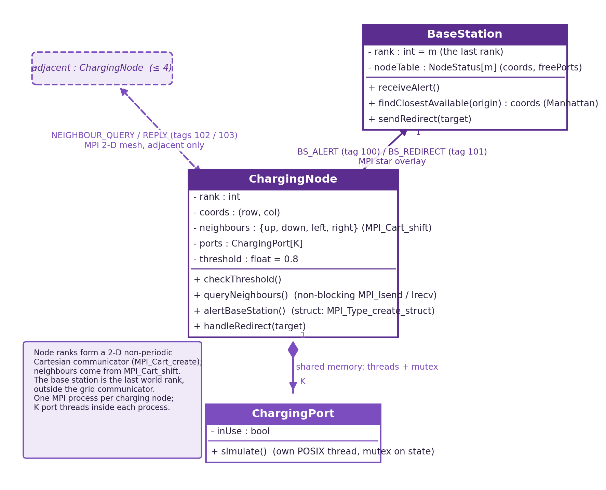
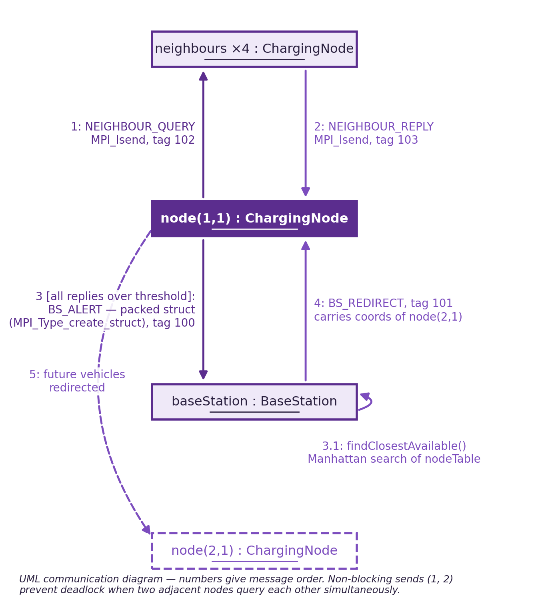
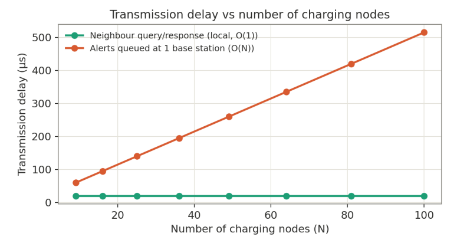
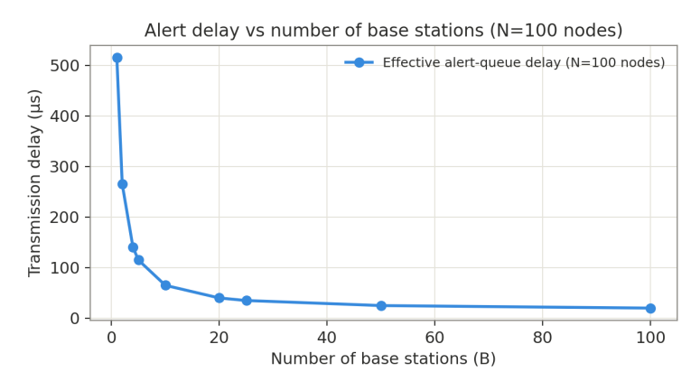
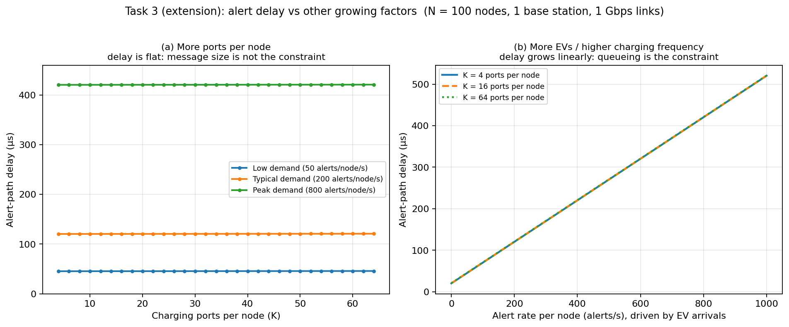

# FIT3143 Parallel Computing, Applied #1

## Distributed Wireless Sensor Network: EV Charging Navigation Simulator

- **Erwyna Soo Wen Xin** (36555789), esoo0013@student.monash.edu
- **Taabish Farooq Bhat** (35473932), ttaa0006@student.monash.edu

Monash University Malaysia, Semester 2 2026. Submitted for the Week 6 assessed applied session.

This document is the written companion to the presentation slides. It contains the detailed
design work behind Tasks 1 to 3. Diagrams and graphs referenced here are also supplied as
separate image files in `diagrams/` and `graphs/`.

**Declaration of AI use:** generative AI was used in preparing parts of this submission.
See `AI_Declaration.pdf` for the itemised declaration.

---

# Task 1: Network topology

## 1.1 Comparison of the Week 5 topologies

Seven topologies from the Week 5 material were compared on network diameter, link count,
fault tolerance and scalability, and then judged against the specific requirements of the
EV charging wireless sensor network (WSN).

| Topology | Diameter (n nodes) | Links | Fault tolerance | Scalability | Suitable for this WSN? |
|---|---|---|---|---|---|
| Line | n - 1 | n - 1 | None: any single link cut splits the network | Poor, worst-case delay grows linearly with n | No |
| Ring | floor(n/2) | n | Survives one cut, degrades to a line | Weak, delay still grows with n | No |
| Star | 2 | n - 1 | Hub is a single point of failure | Hub link becomes the bottleneck | Partly: matches node-to-base-station traffic only |
| Binary tree | about 2 log2(n) | n - 1 | None: any cut disconnects a whole subtree | Good depth growth but no redundancy | No |
| Fully connected | 1 | n(n-1)/2 | Excellent, many disjoint paths | Link count grows quadratically | No: unrealistic for wireless radios |
| 2-D mesh (grid) | about 2(sqrt(n) - 1) | about 2n | Multiple redundant paths between any pair | Grows incrementally, node degree capped at 4 | Yes: matches the specification exactly |
| Hypercube | log2(n) | (n/2) log2(n) | Good | Requires n = 2^k nodes | No: wrong shape for a city grid |

## 1.2 Chosen topology and justification

We choose a **hybrid topology: a 2-D mesh (grid) between the charging nodes, with a star
overlay connecting every node to the base station.**

The specification places the EV charging nodes in a Cartesian grid in which each node
communicates only with its immediate adjacent neighbours. That is precisely the
connectivity a 2-D mesh provides. It is also the realistic choice for a wireless sensor
network, because radio range physically limits each node to nearby nodes rather than to
arbitrary distant ones.

The mesh gives redundant paths, so the simulated network survives a single node or link
failure, unlike a line or a tree where any cut partitions the network. Its node degree is
capped at four regardless of network size, so the per-node radio and processing cost stays
constant as the deployment grows.

The base station is a logging and coordination server that every node must be able to reach
directly, which is star connectivity. Keeping the star as a separate overlay rather than
routing base-station traffic through the mesh means alert and redirect messages do not
consume neighbour-link capacity.

The rejected alternatives fail on concrete grounds rather than on preference. A fully
connected topology would minimise diameter but needs n(n-1)/2 links, which no real wireless
deployment could provide. A ring or a line cannot scale, because worst-case path length
grows linearly with the number of nodes. A hypercube requires the node count to be a power
of two, which does not match a geographic grid of charging stations. A pure star would make
every neighbour query traverse the hub, serialising all traffic at a single point that is
also a single point of failure.

---

# Task 2: Architecture design

## 2.1 Overall structure

The simulator runs as one MPI program on a cluster of multi-core machines. With m charging
nodes arranged as a sqrt(m) x sqrt(m) grid, the program launches **m + 1 MPI processes**:
ranks 0 to m-1 are charging nodes, and the last rank is the base station.

**(a) Base station (1 MPI process).** Holds a table of every node's coordinates and port
availability, receives alert messages, logs them, computes the closest available node by
Manhattan distance on the grid coordinates, and replies with a redirect message telling the
origin node where to send future vehicles. Manhattan distance is the correct measure here
because traffic can only travel along grid links, not diagonally.

**(b) Charging nodes (m MPI processes).** The node ranks form a 2-D non-periodic Cartesian
communicator created with `MPI_Cart_create`, so every node obtains its up, down, left and
right neighbour ranks with `MPI_Cart_shift`. Non-periodic matters for realism: a station at
the edge of the map has no neighbour past the edge, and a wrapping grid would be a torus,
which is not what the specification describes. Edge nodes receive `MPI_PROC_NULL` for
missing neighbours, and sends to `MPI_PROC_NULL` are legal no-ops, so border nodes need no
special-case code.

**(c) Charging ports (threads inside each node process).** Each node process spawns one
POSIX thread (or OpenMP thread) per charging port. The threads update a shared port-state
array protected by a mutex. This deliberately combines both parallelism models:
shared-memory parallelism (threads) exploits the cores inside each machine, and
message-passing parallelism (MPI) connects processes across machines, which is how software
is actually deployed on a cluster of multi-core machines.

Port state is only ever read and written inside one node, so shared memory with a mutex is
cheaper than message passing. Modelling each port as its own MPI process would multiply the
process count and the message overhead for data that never leaves the node.

## 2.2 Static structure (UML class diagram)

## 2.3 Message passing and object interaction

| Message | Route | MPI mechanism | Purpose |
|---|---|---|---|
| `NEIGHBOUR_QUERY` (tag 102) | node to its 4 neighbours | `MPI_Isend` (non-blocking) | ask adjacent nodes for their port utilisation |
| `NEIGHBOUR_REPLY` (tag 103) | neighbour back to node | `MPI_Isend` (non-blocking) | report own utilisation |
| `BS_ALERT` (tag 100) | node to base station | packed struct via `MPI_Type_create_struct` | declare that this node and its whole quadrant are saturated |
| `BS_REDIRECT` (tag 101) | base station to node | `MPI_Send` | carry the coordinates of the closest available node |
| `HEARTBEAT` (optional) | node to base station | periodic `MPI_Isend` | keep the availability table fresh between alerts |

The neighbour exchange **must** use non-blocking sends. Two adjacent nodes can cross their
utilisation thresholds in the same cycle and query each other simultaneously. With blocking
`MPI_Send`/`MPI_Recv`, each would wait for the other to receive first, which is a deadlock.
Non-blocking calls let a node service incoming queries while its own queries are still in
flight.

The alert and redirect pair can safely use blocking calls, because that traffic is not a
cycle: many nodes send to one base station, which loops on receives and replies. No process
waits on a process that is waiting on it.

## 2.4 Machines, cores and required bandwidth

For the 3 x 3 grid used in the specification the program needs **10 processes** (9 charging
nodes plus 1 base station). **Two 8-core machines are sufficient**, at 5 processes per
machine, leaving cores free for the port threads inside each node process.

Traffic is small. An alert is a packed struct under 512 bytes, so even in the worst case
where all 9 nodes alert every second the base-station link carries about

    9 x 512 x 8 = 36,864 bits/s, roughly 37 kbit/s

which is far below a 1 Gbps link. **1 Gbps commodity Ethernet is therefore ample.** The
fabric rather than the message sizes becomes the concern only at thousands of nodes, which
is analysed in Task 3.

---

# Task 3: Communication analysis

## 3.1 Transmission delay model

For every message type, on the 1 Gbps cluster links given in the specification:

    Td = T_overhead + (message_size_bits / bandwidth_bps)

`T_overhead` is taken as approximately 20 microseconds, covering propagation, switch and NIC
processing, and MPI stack latency over Gigabit Ethernet. Bandwidth is 1 Gbps.

| Message | Path | Size | Td (single hop) |
|---|---|---|---|
| Neighbour query | node to neighbour | 32 B | about 20 us |
| Neighbour response | neighbour to node | 64 B | about 20 us |
| Alert | node to base station | 48 B | about 20 us |
| Redirect | base station to node | 40 B | about 20 us |

At these message sizes the serialisation term is well under one microsecond, so fixed
overhead dominates every single-hop transfer.

## 3.2 (a) How delay scales as the number of charging nodes increases

**Neighbour query and reply messages are local and therefore O(1).** Each node talks to at
most four fixed neighbours regardless of grid size, because mesh degree is capped at four.
Adding nodes does not add neighbours, so this delay is flat as N grows.

**Alert messages are O(N).** They all converge on a single base station, which drains them
serially using `MPI_ANY_SOURCE`. The effective delay to clear the alert queue therefore
grows linearly with N, at roughly +5 microseconds per additional simultaneous alert. The
star hub is the scalability limit of the design.

## 3.3 (b) Would increasing the number of base stations reduce delay?

**Not the per-message transmission time.** The delay formula contains no term for the number
of base stations B, so an individual message still costs about 20 microseconds no matter how
many base stations exist.

**What does improve is the queueing delay.** Splitting N nodes across B base stations means
each station serialises only N/B alerts instead of all N, so the queueing component falls as
O(N/B). The graph shows the sharp initial gain and the clear diminishing returns beyond a
handful of stations.

There is a cost that offsets this. Once availability data is spread across several base
stations, those stations must synchronise their tables in order to answer "closest available
node" correctly for a node whose nearest free neighbour is registered elsewhere. That
synchronisation is a serial fraction in the Amdahl sense, so it bounds the achievable
speed-up and explains why the curve flattens rather than continuing to fall.

## 3.4 Extension: delay against other growing factors

Two further growth factors were analysed, holding N at 100 nodes with a single base station.
The model and constants are the same as above, with the alert struct modelled as a 32 byte
header plus one byte of occupancy state per port, so its length is L(K) = 32 + K bytes. The
script that produces this graph is included at `graphs/make_extra_factor_graph.py`.

**Growing the number of charging ports per node (panel a) barely matters.** Going from 4 to
64 ports per node lengthens the alert message by 60 bytes, which at 1 Gbps adds only about
0.5 microseconds to a delay of tens to hundreds of microseconds. Message size is not the
constraint in this design.

**Growing EV arrivals and charging frequency (panel b) matters a great deal.** The alert rate
per node drives the number of alerts queued at the base station, and delay grows linearly
with it, from about 20 microseconds at idle to over 500 microseconds at 1000 alerts per node
per second. The three port-count curves lie on top of one another, which confirms the same
conclusion from the other direction: queueing at the single base station, not payload size,
is what determines delay.

This reinforces the Task 3(b) result. The correct response to rising demand is more base
stations (or a replicated, partitioned availability table), not smaller messages.

---

# Conclusion, limitations and future work

The 2-D mesh keeps neighbour traffic O(1) regardless of network size. The hybrid MPI plus
POSIX-threads architecture separates cheap local port updates, which stay in shared memory,
from expensive network messages, which cross machines. The communication analysis shows the
design scales well in every dimension except the single base station, which becomes an O(N)
bottleneck as the deployment grows.

**Limitations**

- The single base station is both a serialisation point and a single point of failure. It is
  modelled only as a queueing delay, not as a reliability risk.
- The utilisation threshold is fixed at 80 percent. There is no adaptive threshold that
  responds to time-of-day demand.
- The model assumes a regular square grid. Real EV charging station placement is
  geographically irregular, so a real deployment would have non-uniform node degree.
- MPI assumes reliable, ordered delivery. Real wireless links drop packets, so a real WSN
  port of this design would need acknowledgements and timeouts.
- The latency constants (20 us fixed overhead, 5 us per queued alert) are reasoned
  assumptions for MPI over Gigabit Ethernet, not measurements taken on real hardware.

**Future work**

- Replicate and partition the base station, and measure the table-synchronisation overhead
  that Section 3.3 predicts.
- Add fault injection to confirm that the mesh genuinely survives node and link failures.
- Replace the synthetic port occupancy with real EV charging demand traces.
