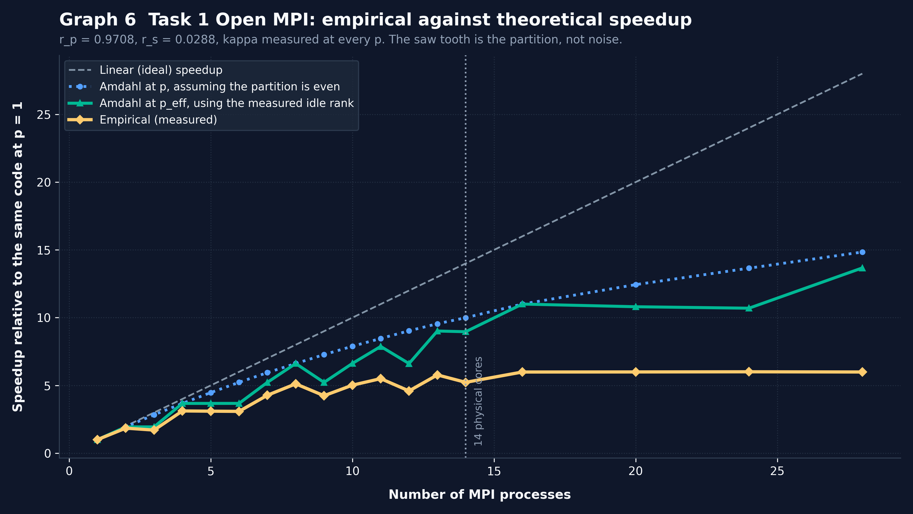
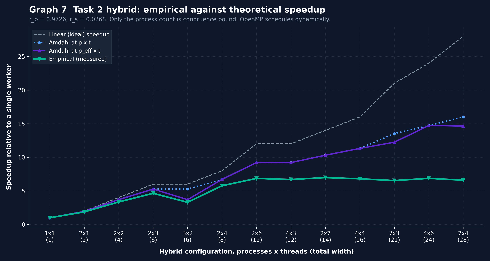
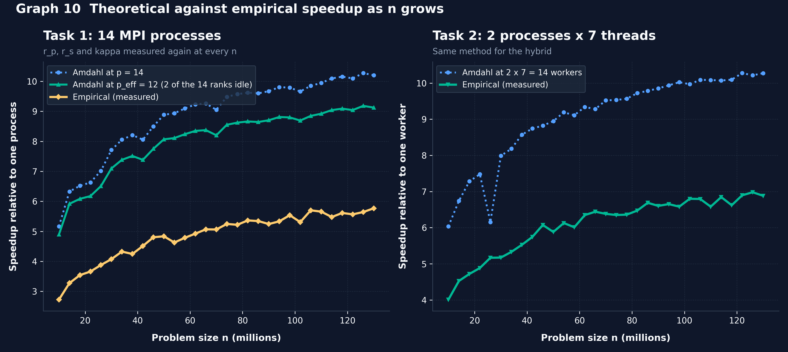

# Task 3: Performance evaluation with Amdahl's Law

**Unit:** FIT3143 Parallel Computing, Semester 2 2026
**Assessment:** Lab 2 (Week 8), Message Passing Interface
**Team:** Erwyna Soo Wen Xin (36555789, esoo0013@student.monash.edu) and Taabish Farooq Bhat (35473932, ttaa0006@student.monash.edu)
**Task 3 written by:** Erwyna Soo Wen Xin

These are our supporting notes for Task 3, submitted under the "Task 3 (Optional)" line of the submission checklist. They show how we measured the serial and parallel parts of Task 1 and Task 2, how we got the Amdahl's Law parameters from those measurements, and how the theoretical speedup compares with the speedup we measured. Every number comes from running our own code and can be reproduced with the scripts in `supporting/scripts/`. We used AI while writing parts of this document, as set out in our AI declaration.

## 1. Summary

- We used Amdahl's Law with a measured communication term, S(p) = 1 / (r_s + r_p / p + kappa(p)). For Task 1, r_p = 0.9708 and r_s = 0.0288.
- Communication is small on one machine: kappa is at most 0.004 of the run, even at 28 processes. On CAAS across two nodes it was still only 0.0012.
- The measured speedup is always below the theoretical speedup, and we measured three reasons: one rank in d does no work when the process count has an odd prime factor d, the root's qsort gets 13 to 20 times slower once the primes arrive interleaved, and the laptop's 14 cores are not all the same speed.
- On CAAS, with identical cores and an even split, Amdahl's Law was within 2% of what we measured, and Task 1 reached 10.31x over the serial program at 8 processes.
- Both the theoretical and the measured speedup rise as n grows, because the search grows much faster than the sort and the file write.

## 2. Machine and method

| Item | Setting |
|---|---|
| Laptop | MacBook Pro 14 inch (November 2023), Apple M3 Max, 14 cores: 10 performance and 4 efficiency |
| MPI | Open MPI from Homebrew, all processes on the one laptop |
| Compiler | `-O2` for all five programs |
| Problem size sweep | 31 values of n from 10 million to 130 million, at 14 workers |
| Width sweep | 1 to 14 workers, then 16, 20, 24 and 28, at n = 130 million |
| Repeats | the fastest of repeated runs is kept |
| Cluster | Monash CAAS, 8 processes across two compute nodes (section 9) |

**Why the fastest run.** Other programs on the laptop can only slow a run down, never speed it up, so the fastest run is the one least affected by background noise. Even so, at 14 workers every core is busy, and the same configuration measured in two different sweeps differed by up to about 20%. For example, Open MPI at 14 processes and n = 130 million took 2.76 s in the n sweep and 3.21 s in the width sweep.

**What the run times include.** Every run time in `results_*.csv` is the wall clock of the whole command, `mpirun` included, so the overall speedup counts starting the processes, communication, computation, sorting and writing the file. Starting `mpirun` and `MPI_Init` alone costs 0.184 s (the median of paired runs in `measure_launch.py`). That fixed cost is why Open MPI is 0.11 to 0.30 s slower than OpenMP at every n in Graph 1.

**Per rank and per thread times.** `task1.c` prints how long each rank spent searching, and `task2.c` prints each thread's time. We added these printouts after the main sweep, so we timed the old and new versions against each other at 8 processes, 14 processes and 2 x 7. The new versions were not slower (1% to 5% faster, which is within run to run noise). Two runs of the submitted `task1.c`:

```
mpirun -np 3 ./task1 130000000          mpirun -np 4 ./task1 130000000
  rank   0:   0.0121 s        2 primes    rank   0:   3.8243 s   1844654 primes
  rank   1:   7.6711 s  3689241 primes    rank   1:   3.8281 s   1844589 primes
  rank   2:   7.6824 s  3688944 primes    rank   2:   3.8272 s   1844669 primes
  Slowest rank / average rank: 1.50       rank   3:   3.8294 s   1844275 primes
                                          Slowest rank / average rank: 1.00
```

At p = 3, rank 0 finishes almost straight away. Section 5 explains why.

## 3. How we separated the serial and parallel parts

A stopwatch around the whole program gives one number, but Amdahl's Law needs to know how much of the run can be spread across processes and how much cannot. So we made timed copies of the programs. The search and the MPI calls are the same as in the submitted code; only timers were added.

| File | What it times |
|---|---|
| `serial_instr.c` | our Week 4 serial program: the search and the file write, separately |
| `task1_instr.c` | Task 1 in phases: broadcast, search, waiting, gather, sort, write |
| `task2_instr.c` | Task 2 in the same phases, plus merging the thread buffers |

Four choices matter for the results:

1. **The timers are in separate files.** Collecting phase times needs extra `MPI_Reduce` calls, which take time. Keeping them out of `task1.c` and `task2.c` means our measuring does not slow the submitted programs down.
2. **Each phase time is the slowest rank's time, not rank 0's.** A collective only finishes when the slowest rank gets to it, so the slowest rank is what the whole run waits for.
3. **An `MPI_Barrier` before the clocks start.** Ranks finish `MPI_Init` at slightly different moments, and without the barrier a rank that starts early would count waiting for the others as work. This is the same trap as in the Week 7 extra class, where an `MPI_Recv` seemed to take four seconds because it was really waiting for rank 0 to finish reading a file.
4. **A second `MPI_Barrier` between the search and the gather.** Our first measurements showed gather times of over 7 seconds. That was not communication: ranks that finished searching early were sitting inside `MPI_Gather` waiting for the slowest rank. The barrier moves that waiting into its own phase, `imbal`, so what is left in `gather` is the real cost of moving the data, 0.005 s at p = 1 and 0.036 s at p = 28.

| Phase | What happens | Counted as |
|---|---|---|
| `bcast` | n is sent to every rank | kappa (communication) |
| `comp` | the search | r_p (parallel) |
| `merge` | Task 2 only: thread buffers copied into one array | kappa |
| `imbal` | waiting at the barrier for the slowest rank | shown separately, not added |
| `gather` | `MPI_Gather` of the counts, then `MPI_Gatherv` of the primes | kappa (communication) |
| `sort` | `qsort` on the root | r_s (serial) |
| `write` | writing 7,378,187 lines on the root | r_s (serial) |

`imbal` is not added to the total, because the slowest rank's search time already covers that wait. As a check, bcast + comp + gather + sort + write adds up to the measured total at every width. `graph8_phase_breakdown.png` in `supporting/graphs/` shows this split for every width.

## 4. The model

This is Amdahl's Law with a communication term, in the same form as the Week 7 extra class:

```
S(p) = 1 / ( r_s + r_p / p + kappa(p) )

r_p      = comp(1) / T(1)              the search, the only part that spreads out
r_s      = (sort + write)(1) / T(1)    qsort and the file write on the root
kappa(p) = (bcast + gather)(p) / T(1)  measured separately at every p
```

T(1) is the total time of the same program on one process, so r_p + r_s + kappa(1) = 1. As p gets very large, the Amdahl ceiling is 1 / r_s.

**Why the baseline is Task 1 on one process, not the Week 4 serial program.** Task 1 only tries divisors of the form 6k - 1 and 6k + 1, while our Week 4 serial program tries every odd divisor. On one process Task 1 is already 1.42 times faster than Week 4 (15.01 s against 21.26 s at n = 130 million). If r_p and r_s came from the Week 4 program, that faster primality test would be counted as parallel speedup. The speedups against the Week 4 serial program that the specification asks for are in Graphs 2 to 5 and in section 8.

## 5. Load imbalance: one rank in d does no work

`task1.c` gives rank r the numbers 3 + 2r, then 3 + 2r + 2p, 3 + 2r + 4p, and so on. We picked this cyclic stride over a block split because testing k takes about sqrt(k) divisions, so a block split would hand the last rank all of the most expensive numbers.

Timing each rank showed a problem with the stride. Take any odd prime d that divides p. Adding 2p never changes the remainder when a number is divided by d, so every number rank r tests leaves the same remainder as 3 + 2r. For the rank where that remainder is 0, every number it tests is a multiple of d, and `is_prime` throws those out within its first few checks. That rank finishes almost straight away and then waits for everyone else.

So with p processes only p (1 - 1/d) ranks do real work, where d is the smallest odd prime factor of p. When p is a power of two there is no odd factor and all p ranks work. We call this p_eff. At p = 3, rank 0 only gets 3, 9, 15, 21 and so on, and it found 2 primes (2 and 3) while ranks 1 and 2 found about 3.69 million each.

The imbalance ratio, the slowest rank's search time over the average, is close to the prediction 1 / (1 - 1/d) at every width we measured:

| p | d | Measured slowest / average | Predicted 1 / (1 - 1/d) |
|---|---|---|---|
| 1, 2, 4, 8 | none | 1.00 | 1.00 |
| 16 | none | 1.04 | 1.00 |
| 3, 6, 9 | 3 | 1.50 | 1.50 |
| 12, 24 | 3 | 1.52, 1.53 | 1.50 |
| 5 | 5 | 1.25 | 1.25 |
| 10, 20 | 5 | 1.26, 1.29 | 1.25 |
| 7 | 7 | 1.17 | 1.17 |
| 14, 28 | 7 | 1.30, 1.21 | 1.17 |
| 11 | 11 | 1.14 | 1.10 |
| 13 | 13 | 1.11 | 1.08 |

At the larger widths the measured ratio is a little above the prediction, because once there are more than 10 processes some of them run on the slower efficiency cores.

This is why Open MPI at 3 processes (8.52 s) is slower than at 2 processes (7.94 s): the third process adds no search capacity but still takes part in every collective. The same thing shows up in the hybrid. With the same 6 workers, 2 processes x 3 threads took 3.39 s while 3 processes x 2 threads took 4.72 s, because one of the 3 processes has nothing to search. With 2 x 6 against 4 x 3, where both process counts are powers of two, the times are close (2.33 s and 2.41 s).

Inside each process the OpenMP threads do not have this problem. `schedule(dynamic, 1000)` lets a thread come back for another chunk as soon as it finishes one, so the threads in a process finish together. At 2 x 7, all 14 threads finished within 0.004 s of each other (1.505 s to 1.509 s).

## 6. Theoretical against measured speedup as processes are added

### Task 1, Open MPI

| Parameter | Value |
|---|---|
| T(1), Task 1 on one process | 14.264 s |
| r_p | 0.9708 |
| r_s | 0.0288 |
| Amdahl ceiling, 1 / r_s | 34.7x |
| Phases at p = 1 | search 13.847 s, sort 0.021 s, write 0.390 s |
| Phases at p = 14 | search 1.893 s, gather 0.017 s, sort 0.379 s, write 0.439 s |

| p | d | p_eff | Slowest rank search (s) | Fastest rank search (s) | kappa(p) | Amdahl at p | Amdahl at p_eff | Measured |
|---|---|---|---|---|---|---|---|---|
| 1 | none | 1 | 13.847 | 13.847 | 0.00036 | 1.00 | 1.00 | 1.00 |
| 2 | none | 2 | 7.019 | 7.015 | 0.00045 | 1.94 | 1.94 | 1.85 |
| 3 | 3 | 2 | 7.620 | 0.012 | 0.00059 | 2.83 | 1.94 | 1.71 |
| 4 | none | 4 | 3.817 | 3.812 | 0.00069 | 3.67 | 3.67 | 3.12 |
| 5 | 5 | 4 | 3.812 | 0.013 | 0.00069 | 4.47 | 3.67 | 3.10 |
| 6 | 3 | 4 | 3.838 | 0.006 | 0.00059 | 5.23 | 3.67 | 3.09 |
| 7 | 7 | 6 | 2.557 | 0.011 | 0.00068 | 5.95 | 5.23 | 4.28 |
| 8 | none | 8 | 1.934 | 1.931 | 0.00097 | 6.62 | 6.62 | 5.12 |
| 9 | 3 | 6 | 2.579 | 0.004 | 0.00079 | 7.27 | 5.22 | 4.24 |
| 10 | 5 | 8 | 1.976 | 0.006 | 0.00083 | 7.89 | 6.62 | 5.02 |
| 11 | 11 | 10 | 1.763 | 0.008 | 0.00107 | 8.46 | 7.87 | 5.50 |
| 12 | 3 | 8 | 2.240 | 0.003 | 0.00099 | 9.03 | 6.61 | 4.59 |
| 13 | 13 | 12 | 1.633 | 0.008 | 0.00121 | 9.55 | 9.01 | 5.78 |
| 14 | 7 | 12 | 1.893 | 0.005 | 0.00184 | 10.00 | 8.96 | 5.23 |
| 16 | none | 16 | 1.502 | 1.360 | 0.00138 | 11.00 | 11.00 | 5.99 |
| 20 | 5 | 16 | 1.485 | 0.003 | 0.00303 | 12.44 | 10.81 | 5.99 |
| 24 | 3 | 16 | 1.467 | 0.002 | 0.00397 | 13.65 | 10.70 | 6.01 |
| 28 | 7 | 24 | 1.485 | 0.003 | 0.00388 | 14.84 | 13.67 | 5.99 |



Plain Amdahl at p assumes the work is split evenly, and it sits above our measurement everywhere. Amdahl at p_eff follows the dips in the measured curve at p = 3, 5, 6, 7, 9 and so on, which shows the saw tooth comes from the partition and is not noise.

That still leaves a gap, and the phase data shows a second cause. At p = 1 the root's `qsort` takes 0.021 s, because a single rank finds its primes already in order. From p = 2 onwards the primes arrive interleaved and `qsort` takes 0.28 to 0.42 s. So the part of the run that cannot be spread out is bigger than the p = 1 run suggests. Using the sort and write times measured at each p instead:

| p | Amdahl, r_s from p = 1 | Amdahl, sort and write measured at p | The same at p_eff | Measured |
|---|---|---|---|---|
| 2 | 1.94 | 1.87 | 1.87 | 1.85 |
| 8 | 6.62 | 5.52 | 5.52 | 5.12 |
| 14 | 10.00 | 7.78 | 7.14 | 5.23 |
| 28 | 14.84 | 10.12 | 9.56 | 5.99 |

With the serial part measured at each p, the model is within about 1% at p = 2 and within 8% at p = 8. The gap that is left at 14 and above is the hardware: past 10 processes some ranks have to run on the 4 much slower efficiency cores, and past 14 there are more processes than cores. It also means the realistic ceiling is about 17x (a serial share of about 0.058), not 34.7x.

### Task 2, hybrid Open MPI + OpenMP

| Parameter | Value |
|---|---|
| T(1 worker), Task 2 as 1 process x 1 thread | 15.163 s |
| r_p | 0.9726 |
| r_s | 0.0268 |

For the hybrid, kappa also includes the merge of the thread buffers.

| p x t | Workers | p_eff x t | kappa | Amdahl at p x t | Amdahl at p_eff x t | Measured |
|---|---|---|---|---|---|---|
| 1 x 1 | 1 | 1 | 0.00059 | 1.00 | 1.00 | 1.00 |
| 2 x 1 | 2 | 2 | 0.00048 | 1.95 | 1.95 | 1.87 |
| 2 x 2 | 4 | 4 | 0.00053 | 3.70 | 3.70 | 3.35 |
| 2 x 3 | 6 | 6 | 0.00053 | 5.28 | 5.28 | 4.64 |
| 3 x 2 | 6 | 4 | 0.00064 | 5.28 | 3.70 | 3.30 |
| 2 x 4 | 8 | 8 | 0.00051 | 6.72 | 6.72 | 5.77 |
| 2 x 6 | 12 | 12 | 0.00062 | 9.22 | 9.22 | 6.85 |
| 4 x 3 | 12 | 12 | 0.00066 | 9.21 | 9.21 | 6.69 |
| 2 x 7 | 14 | 14 | 0.00068 | 10.31 | 10.31 | 6.98 |
| 4 x 4 | 16 | 16 | 0.00071 | 11.32 | 11.32 | 6.80 |
| 7 x 3 | 21 | 18 | 0.00082 | 13.52 | 12.24 | 6.53 |
| 4 x 6 | 24 | 24 | 0.00056 | 14.72 | 14.72 | 6.86 |
| 7 x 4 | 28 | 24 | 0.00089 | 16.01 | 14.66 | 6.59 |



The pattern is the same as Task 1. Only the process count can leave a rank idle, so the configurations with 3 or 7 processes fall furthest below the model, and the best results use 2 or 4 processes with more threads. The sort cost behaves the same way too: 0.023 s at 1 x 1 and 0.29 to 0.34 s everywhere else.

## 7. Theoretical against measured speedup as n grows

Graphs 6 and 7 keep n fixed. The specification also asks for the theoretical speedup as n grows, and r_p and r_s change with n, so we measured them again at every n. `run_phases_by_n.py` runs the timed programs at each of the 31 values of n twice, back to back: on one worker, to get r_p, r_s and T(1) for that n, and on 14 workers (14 processes for Task 1, 2 x 7 for Task 2), to get kappa and the measured speedup. We ran this sweep on 15 September, mostly on battery power, and single worker times came out about 8% slower than in the main sweep (15.45 s against 14.26 s at n = 130 million). Every comparison below uses runs from this same sweep, so it compares like with like.



| n | Task 1 r_s | Task 1 kappa | Task 1 Amdahl at p_eff = 12 | Task 1 measured | Task 2 r_s | Task 2 Amdahl at 2 x 7 | Task 2 measured |
|---|---|---|---|---|---|---|---|
| 10 million | 0.096 | 0.033 | 4.89 | 2.72 | 0.096 | 6.03 | 4.01 |
| 30 million | 0.056 | 0.007 | 7.10 | 4.07 | 0.056 | 7.99 | 5.17 |
| 50 million | 0.042 | 0.003 | 8.07 | 4.84 | 0.042 | 8.95 | 5.88 |
| 70 million | 0.040 | 0.002 | 8.20 | 5.06 | 0.035 | 9.52 | 6.38 |
| 90 million | 0.032 | 0.002 | 8.70 | 5.24 | 0.032 | 9.85 | 6.60 |
| 110 million | 0.030 | 0.001 | 8.92 | 5.66 | 0.029 | 10.08 | 6.58 |
| 130 million | 0.027 | 0.001 | 9.13 | 5.77 | 0.027 | 10.27 | 6.88 |

All 31 values are in `supporting/results/amdahl_by_n.csv`. What this shows:

- **Both speedups rise with n.** The search grows much faster than n, because each candidate k costs up to sqrt(k) divisions, while sorting and writing grow roughly with the number of primes. So the serial share r_s falls from 0.096 at 10 million to 0.027 at 130 million, and the theoretical speedup rises with it. This is the idea behind Gustafson's Law: as the problem grows, the parallel part grows faster than the serial part, so more speedup is possible.
- **kappa matters more at small n.** At n = 10 million the whole run on one process takes only 0.43 s, so the fixed cost of the broadcast and the gather is 3.3% of it. By 130 million it is about 0.1%.
- **The gap between theory and measurement stays a similar proportion as n grows.** Task 1 measured 56% to 63% of Amdahl at p_eff, and Task 2 measured about two thirds of Amdahl at every n. That points to the same hardware limit as sections 6 and 8, not to anything in the model that depends on n.
- **One noisy point.** For Task 2 at n = 26 million the single worker's file write happened to be slow, which pushed r_s up and made the theoretical curve dip. We left it in rather than re-running just that point.

## 8. Speedup against the Week 4 serial program

| Measurement | Value |
|---|---|
| Week 4 serial program at n = 130 million | 21.26 s |
| Open MPI, best over the n sweep (14 processes) | 7.80x at n = 126 million |
| Open MPI, best over the width sweep | 7.76x at 11 processes |
| Hybrid, best (2 processes x 7 threads) | 9.28x |
| POSIX Threads, best | 7.79x |
| OpenMP, best | 8.27x |
| Open MPI efficiency at 2, 4, 8 and 14 processes | 1.34, 1.13, 0.91 and 0.47 |

An efficiency above 1 at 2 and 4 processes is not superlinear parallelism. It comes from the faster primality test in Task 1, which is 1.42 times faster on one process. Against Task 1 on one process, the efficiency at 2, 4, 8 and 14 processes is 0.92, 0.78, 0.64 and 0.37.

Every version levels off at about 7x on the laptop instead of approaching 14x. Once more than 10 workers are running, some of them have to use the 4 efficiency cores, which are much slower than the performance cores, and past 14 workers there are more workers than cores, so adding workers only adds switching between them.

## 9. CAAS: the same code across two compute nodes

We ran Task 1 and Task 2 on Monash CAAS on 9 September 2026 (job 39361), with 8 processes split 4 and 4 across two compute nodes, so `MPI_Gatherv` had to go over the network. The prime list matched the serial reference exactly. The serial baseline on the cluster (our Week 4 search) took 78.29 s.

| p | Total (s) | Speedup vs serial | Speedup vs p = 1 | Amdahl | Gap | kappa(p) |
|---|---|---|---|---|---|---|
| 1 | 52.50 | 1.49x | 1.00x | 1.00 | 0.0% | 0.00015 |
| 2 | 26.86 | 2.91x | 1.95x | 1.96 | 0.4% | 0.00072 |
| 4 | 13.99 | 5.60x | 3.75x | 3.78 | 0.7% | 0.00116 |
| 8 | 7.59 | 10.31x | 6.91x | 7.05 | 1.9% | 0.00124 |

From the p = 1 run on the cluster, r_p = 0.9819 and r_s = 0.0179.

- **Close to linear scaling.** 86.4% parallel efficiency at 8 processes, and the speedup was still rising.
- **Amdahl's Law within 2%.** On identical cores with an even split (all powers of two), the model matches the measurement. This supports our explanation of the bigger gap on the laptop.
- **Communication was still small.** We expected the network to make kappa the biggest term, and it did not. The gather at p = 8 took 0.063 s across the two nodes against 0.014 s on the laptop, about 4.6 times slower, but that is still only 0.12% of the run: about 59 MB of primes sent once, against 52 s of searching. Communication would only dominate at a much smaller n, with many more processes, or on a slower network.

This run only used powers of two, so the idle rank problem from section 5 does not appear in it. Our analysis of the run is in `supporting/caas/CAAS_Analysis.pdf`, and the raw output is `supporting/caas/caas_results.txt`.

## 10. Answers to the questions in the specification

**How does the actual speedup compare against the theoretical speedup?** The measured speedup is always lower. On the laptop the gap comes from three things we measured: the idle rank at process counts with an odd prime factor (section 5), the root's qsort costing more once the primes arrive interleaved (section 6), and the slower efficiency cores plus oversubscription past 10 and 14 workers (section 8). On CAAS, where the cores are identical and we used powers of two, Amdahl's Law was within 2%.

**Will more MPI processes always increase the actual and the theoretical speedup?** No. The theoretical speedup can never pass 1 / r_s, which is realistically about 17x once the sort cost at p of 2 or more is included, and kappa grows with p, from 0.0004 at p = 1 to 0.0039 at p = 28. In practice it is worse. Going from 2 to 3 processes made Task 1 slower because the third rank does no work, and past 14 processes the laptop has no more cores to give.

**How would the workload distribution affect the speedup?** A lot. A block split would give the last rank the largest numbers, which cost the most to test, so every other rank would wait for it. Our cyclic stride avoids that, but it locks each rank to one remainder class and leaves one rank in d idle at some process counts. Handing out small chunks of numbers in turn, as our Week 4 POSIX Threads version did, would keep the mix of cheap and expensive numbers and give every rank a spread of remainders, so p_eff would equal p. Inside each process, OpenMP's dynamic schedule already keeps the threads balanced.

**Will the speedup results be the same across different machines?** No. r_s depends on how fast the machine sorts and writes the file, and kappa depends on how the processes are connected, so both change between machines. Our laptop levelled off at about 7x because of its mixed cores, while CAAS kept scaling to 10.31x at 8 processes. What would stay the same is the idle rank pattern at process counts with an odd prime factor, because it comes from the arithmetic of the stride and not from the hardware.

**Would we recommend Open MPI for this problem?** Not on a single machine. On the laptop Open MPI was never faster than OpenMP, it pays 0.184 s just to start, and the code is longer, because processes have to send their results while threads share memory. Open MPI is the right choice when the work has to run across more than one machine, as on CAAS, because threads cannot reach another node.

## 11. Limitations and what we would change

1. **The stride partition leaves one rank in d idle** when p has an odd prime factor d. Handing out chunks of 1000 odd numbers in turn would fix this at every p. We have not changed `task1.c` and `task2.c` for it, so that every measurement in this document and in our slides matches the submitted code.
2. **The root sorts the whole list with qsort.** Each rank's primes are already in ascending order, so merging the p sorted lists would take O(N log p) instead of O(N log N) and shrink the serial part.
3. **The file write is serial** and takes about 0.4 s for 7.4 million lines. A bigger output buffer would shorten it, but it would still run only on the root.
4. **The CAAS run only used powers of two**, so it confirms the scaling but not the idle rank problem. Running p = 3, 6 and 12 on the cluster would test that.
5. **Two baselines.** Task 1 uses a faster primality test than our Week 4 serial program, so we report speedups against both.
6. **Noise at full width.** At 14 workers every core on the laptop is busy, and the same configuration differed by up to about 20% between sweeps.
7. **`MPI_Gatherv` takes `int` counts**, so the gather would fail above about 2.1 billion primes. That is far beyond any n we tested.
